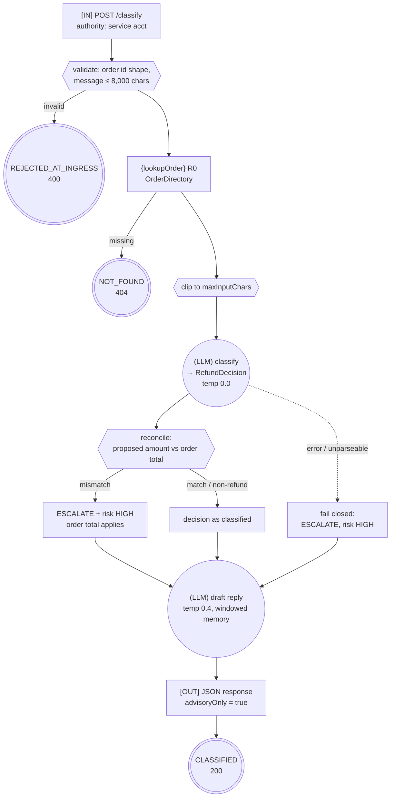

# Control-Flow Graph — 01 ChatClient Foundation

| Field | Value |
|-------|-------|
| Service | `chatclient-foundation` |
| Job statement | Given a customer refund message and an order id, classify the request against policy and draft a reply. Take no action. |
| Trigger | `POST /api/refunds/classify` (synchronous HTTP) |
| Authority | service account, read-only on the order directory |
| Architecture | linear call — no orchestration, no tools |
| Agency budget | **0** model-chosen edges |
| Per-run cost ceiling | 2 model calls, ≤ 1,024 completion tokens each |
| Wall-clock deadline | 30 s per model call (`spring.ai.anthropic.timeout`) |
| Data classes | customer free text (confidential), order facts (internal) |
| Terminal states | `CLASSIFIED`, `NOT_FOUND`, `REJECTED_AT_INGRESS` |

---

## 1. Graph



Both edges out of the model nodes are **deterministic** — the model returns a value, code decides
what happens next. That is why the agency budget is zero despite two model calls.

---

## 2. Tool boundary table

| Tool | Class | Reversible | Idempotency key | Dry-run | Rate limit | Notes |
|------|-------|-----------|-----------------|---------|------------|-------|
| `OrderDirectory.find` | `R0` | n/a | — | — | per-request | in-memory read of our own data |

There are **no** `W*`, `E*` or `P1` tools in this project, and no `@Tool` methods at all: the model
cannot call anything. That is deliberate — learn the mechanics where nothing can go wrong, then add
gates in project 02.

---

## 3. Irreversible-action catalogue

**Empty.** Justification (required by Gate 3): the service performs no writes, sends nothing, and
exposes no tool to the model. The drafted reply is returned to the caller as data; sending it is an
`E2` action that belongs to project 02, which is why `CustomerReplyWriter` has no send path.

---

## 4. Approval points

None required — nothing irreversible occurs. The `advisoryOnly: true` field in the response is the
contract that tells a caller this endpoint cannot have moved money.

---

## 5. Trust boundaries

```
┌─ untrusted ──────────────────────────────┐
│  ClassifyRequest.message  (customer text)│
└──────────────────────────────────────────┘
                │
                ▼ enters the context window in the USER message only
     (LLM classify) ──▶ RefundDecision ──▶ reconcile() ──▶ response
                                              ▲
                                    order total from OrderDirectory
```

| Boundary | Untrusted source | Validator | Test |
|----------|------------------|-----------|------|
| ingress | HTTP body | `ClassifyRequest` Bean Validation (`@Pattern`, `@Size`) | `RefundDeskApiTest.rejectsBadOrderId` |
| prompt | `message` | `RefundClassifier.boundInput` + fenced user-message template | `RefundClassifierTest.boundsInputSize` |
| system message | — | never receives untrusted text | `RefundClassifierTest.untrustedTextNeverEntersTheSystemMessage` |
| model output | `RefundDecision` | `RefundClassifier.reconcile` — order total overrides | `RefundClassifierTest.rejectsInflatedAmount` |

**Taint rule:** satisfied trivially — there is no irreversible action for tainted text to reach.
The reconciliation step exists anyway, because the decision this service emits is consumed by
systems that *can* pay.

---

## 6. Budgets

| Budget | Limit | Enforced by | On exhaustion |
|--------|-------|-------------|---------------|
| Model calls per request | 2 | code structure (no loops) | n/a |
| Completion tokens | 1,024 | `agentic.foundation.max-tokens` | provider truncates; finish reason recorded |
| Input characters | 8,000 | `agentic.foundation.max-input-chars` | clipped with a marker |
| Conversation memory | 20 messages | `MessageWindowChatMemory` | oldest dropped |
| Model call wall clock | 30 s | `spring.ai.anthropic.timeout` | exception → fail closed to `ESCALATE` |

No cycles exist, so invariant 1 holds by construction.

---

## 7. Failure paths

| Failure | Detection | Response | Terminal |
|---------|-----------|----------|----------|
| Unparseable model output | `entity()` throws | `ESCALATE`, risk `HIGH` | `CLASSIFIED` |
| Provider error / timeout | exception | `ESCALATE`, risk `HIGH` | `CLASSIFIED` |
| Incomplete decision (null fields) | `reconcile` | `ESCALATE` | `CLASSIFIED` |
| Amount mismatch | `reconcile` | `ESCALATE`, order total applies, risk `HIGH` | `CLASSIFIED` |
| Unknown order | `OrderDirectory` empty optional | 404, no model call | `NOT_FOUND` |
| Invalid request | Bean Validation | 400, no model call | `REJECTED_AT_INGRESS` |

Every failure resolves to a value, never to a 500 that a client would retry.

---

## 8. Graph invariants

| Invariant | Holds? | Evidence |
|-----------|--------|----------|
| 1. No unbounded cycles | ✅ | no loops; two fixed model calls |
| 2. No ungated one-way doors | ✅ | no irreversible actions exist |
| 3. No unvalidated taint flow | ✅ | `reconcile()` + no reachable effects |
| 4. No effect before checkpoint | ✅ | vacuous — no effects |

---

## 9. Observability

| Signal | Where |
|--------|-------|
| Decision records | `DecisionLog`, one row per model call, retrievable via `GET /api/refunds/runs/{runId}/decisions` |
| `runId` correlation | `RunContextAdvisor` → MDC → log pattern `[%X{runId}]` |
| Usage + finish reason | recorded per call from `ChatResponseMetadata` |
| Framework observations | `gen_ai.client.operation`, `spring.ai.advisor` via Micrometer |
| Replay | reconstruct-only (decision log holds the structured output) |

---

## 10. Review

| Gate | Owner | Status |
|------|-------|--------|
| 0 Frame | Eng | ✅ |
| 1 CFG + invariants | Eng | ✅ |
| 2 Tool classes | Eng | ✅ (one `R0` read) |
| 3 Irreversible catalogue | Eng | ✅ empty, justified |
| 4 Approvals | Eng | ✅ n/a |
| 5 Trust boundaries | Security | ✅ |
| 6 Architecture choice | Eng | ✅ linear; no runtime decision requires more |
| 7 Budgets | Eng | ✅ |
| 8 Failure paths | Eng | ✅ |
| 9 Observability | Eng | ✅ |
| 10 Runbook + kill switch | Ops | ✅ n/a — no effects to kill |
