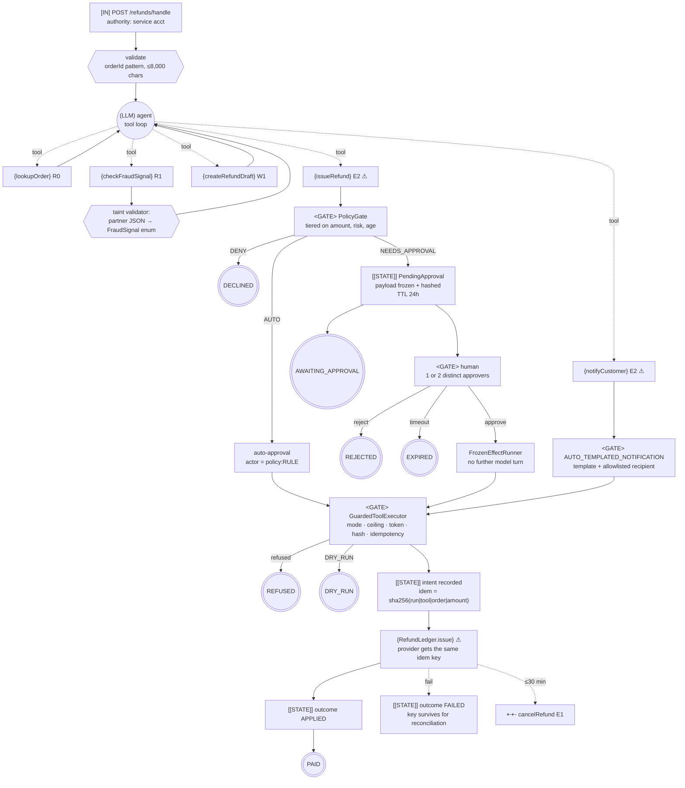

# Control-Flow Graph — 02 Tool Calling with Guardrails

| Field | Value |
|-------|-------|
| Service | `tool-calling-guardrails` |
| Job statement | Given a customer refund message, the model may read order and fraud data and, subject to a policy gate, issue a refund and notify the customer. |
| Trigger | `POST /api/refunds/handle`, and `POST /api/approvals/{id}/approve` for the resume |
| Authority | service account: read orders, write ledger, send templated notifications. No IAM, no schema, no bulk operations. |
| Architecture | gated tool loop (model chooses tools; code owns every effect) |
| Agency budget | **4** model-chosen edges — one per exposed tool the model may call |
| Per-run cost ceiling | 10 tool calls (framework), ≤ 2 irreversible calls (guard), 1,024 completion tokens |
| Wall-clock deadline | 30 s per model call |
| Data classes | customer free text (confidential), order + email (PII), payment reference (regulated) |
| Terminal states | `PAID`, `DECLINED`, `AWAITING_APPROVAL`, `EXPIRED`, `REJECTED`, `REFUSED` |

---

## 1. Graph



`agency = 4`: the model chooses *whether* to call each tool. It chooses nothing else — not the
amount, not the recipient, not the template body, not whether the gate passes.

---

## 2. Tool boundary table

| Tool | Class | Reversible | Idempotency key | Dry-run | Ceiling/run | Notes |
|------|-------|-----------|-----------------|---------|-------------|-------|
| `lookupOrder` | `R0` | n/a | — | n/a | 6 | order-id pattern validated |
| `checkFraudSignal` | `R1` | n/a | — | n/a | 3 | **result is tainted**; mapped to an enum |
| `createRefundDraft` | `W1` | yes | `sha256(run\|tool\|order\|amount)` | yes | 2 | internal only |
| `issueRefund` | `E2` ⚠ | **no** | same shape | yes | 1 | takes an *identifier*; amount read from the order |
| `notifyCustomer` | `E2` ⚠ | **no** | same shape | yes | 1 | template id only; recipient from the order record |
| `cancelRefund` | `E1` | yes ≤30 min | same shape | yes | 1 | compensation; reuses the original key |

Startup fails if a `@Tool` method lacks `@ToolBoundary`, or if an `irreversible` tool is missing
from `agentic.tools.approval-required-tools`
([`GuardrailConfig`](../src/main/java/io/github/vuppalapatisn/agentic/tools/config/GuardrailConfig.java)).

---

## 3. Irreversible-action catalogue

| Field | `issueRefund` | `notifyCustomer` |
|-------|---------------|------------------|
| Class | `E2` | `E2` |
| Blast radius | one customer, up to the order total | one customer, reputational |
| Detection latency | minutes (ledger reconciliation) | immediate |
| Compensation | `cancelRefund` (pre-settlement) | **NONE** — a correction is a new effect |
| Window | 30 min (`RefundLedger.SETTLEMENT_DELAY`) | — |
| Approval | auto < $100 & LOW & ≤30 d; single < $1,000; **dual** ≥ $1,000 or HIGH risk | auto: fixed template + allowlisted recipient |
| Idempotency key | `sha256(runId\|issueRefund\|orderId\|amountMinor)` | `sha256(runId\|notifyCustomer\|orderId\|0)` |
| Dry-run | yes | yes |
| Rate limit | 1 per run, ≤2 irreversible calls per run | 1 per run |
| Audit | `AuditLog` row + `agentic.tool.irreversible` counter | same |

Ordering note: the notification is sent **after** the refund, because it is the less reversible of
the two. If the payout fails, nothing was said to the customer.

---

## 4. Approval points

| # | Gate | Type | Rule | TTL | On timeout | On reject |
|---|------|------|------|-----|------------|-----------|
| 1 | `PolicyGate.decideRefund` | policy | tiered on amount × risk × age | — | — | `DECLINED` |
| 2 | `ApprovalStore` single | human | `SINGLE_APPROVER_DEFAULT` | 24 h | `EXPIRED` (never auto-approve) | `REJECTED` |
| 3 | `ApprovalStore` dual | human ×2 | `DUAL_CONTROL_HIGH_VALUE_OR_RISK` | 24 h | `EXPIRED` | `REJECTED` |
| 4 | `notifyCustomer` | policy | `AUTO_TEMPLATED_NOTIFICATION` | — | — | — |

Seven-property check:

| Property | Where | Test |
|----------|-------|------|
| Durable | `PendingApproval` stored before the tool returns | `singleApproverTierSuspends` |
| Frozen | `PayloadHash.of(payload)`, verified in `consume` | `refusesPayloadMismatch` |
| Attributed | `PendingApproval.approvals` + audit rows | `RefundToolsTest` |
| Bounded | `expiresAt`, sweeper, expiry ⇒ no | `refusesExpiredApproval`, `expiryNeverPays` |
| Replay-safe | single-use consume **and** the idempotency ledger | `replaySafe`, `idempotencyStopsASecondPayment` |
| Legible | `PolicyGate.explain` renders from trusted data | `explanationComesFromTheOrderRecord` |
| Refusable | `REJECTED` is terminal | `rejectionIsTerminal` |

The in-memory store is this project's known limitation: an approval does not survive a restart.
That is precisely what [project 07](../../07-state-machine-orchestration/) fixes by making the
approval a persisted state.

---

## 5. Trust boundaries

```
┌─ untrusted ────────────────────────────────────────────┐
│  customer message (user message only, fenced)          │
│  fraud provider response body  ← includes a hostile     │
│                                  "note" for c-9001      │
└────────────────────────────────────────────────────────┘
        │                              │
        ▼                              ▼
   (LLM) tool loop            FraudService.check()  ── validator ──▶ FraudSignal enum
        │                                                                  │
        ▼                                                                  ▼
  {issueRefund}(orderId)  ──▶ PolicyGate reads ORDER RECORD + ENUM ──▶ decision
```

| Boundary | Untrusted source | Validator | Test |
|----------|------------------|-----------|------|
| ingress | HTTP body | Bean Validation on `HandleRequest` | `GuardrailIntegrationTest` |
| prompt | customer text | fenced user message, labelled as data | agent system prompt |
| `R1` result | partner JSON | `FraudService.check` → enum, unknown ⇒ `UNAVAILABLE` | `fraudProviderInjectionIsDroppedAtTheBoundary` |
| tool args | model output | `@Pattern`/`@NotBlank`; no amount or recipient parameter exists | `RefundToolsTest` |
| tool context | — | `runId` from `ToolContext`, never a parameter | `runIdMustComeFromTheToolContext` |
| egress | recipient | `notificationAllowlist` | `NotificationGateway` |

**Taint rule:** no path from untrusted text to an irreversible argument. Enforced structurally —
`issueRefund(String orderId)` has no other parameter, so there is nothing for injected text to fill.

---

## 6. Budgets

| Budget | Limit | Enforced by | On exhaustion |
|--------|-------|-------------|---------------|
| Total tool calls | 10 | `spring.ai.tools.limits.max-total-tool-calls` | `RETURN_ERROR_RESPONSE` to the model |
| Calls per tool | 1–3 | framework limits **and** `@ToolBoundary.maxCallsPerRun` | refused + audited |
| Irreversible calls per run | 2 | `agentic.tools.max-irreversible-per-run` | `CallCeilingExceededException` |
| Completion tokens | 1,024 | model options | provider truncates |
| Model call wall clock | 30 s | `spring.ai.anthropic.timeout` | agent returns a safe message |
| Approval TTL | 24 h | `ApprovalStore` + sweeper | `EXPIRED` |
| Compensation window | 30 min | `RefundLedger` | refused, escalate to a human |

---

## 7. Failure paths

| Failure | Detection | Response | Terminal |
|---------|-----------|----------|----------|
| No approval token | `ApprovalStore.consume` | `MISSING_TOKEN`, refused, audited | `REFUSED` |
| Hash mismatch | `consume` | `PAYLOAD_MISMATCH` — a security event | `REFUSED` |
| Expired | `consume` / sweeper | `EXPIRED` | `EXPIRED` |
| Duplicate resume | `consume` + ledger | executes once | `PAID` |
| Same approver twice | `approve` | `DUPLICATE_APPROVER` | still `AWAITING_APPROVAL` |
| Provider error mid-payout | executor catch | ledger `FAILED`, key retained for reconciliation | `REFUSED` |
| Compensation after settlement | `RefundLedger.cancel` | refused; **incident, not a retry** | `REFUSED` |
| Unknown template | `NotificationGateway` | refused, nothing sent | `REFUSED` |
| Recipient off allowlist | `assertAllowed` | refused, nothing sent | `REFUSED` |
| Model/tool exception | `RefundAgent` catch | safe operator message, audited | `REFUSED` |
| Kill switch on | executor | every effect refused; reads still work | `REFUSED` |

---

## 8. Graph invariants

| Invariant | Holds? | Evidence |
|-----------|--------|----------|
| 1. No unbounded cycles | ✅ | framework total-call limit + per-tool ceilings + `max-irreversible-per-run`, all audited on breach |
| 2. No ungated one-way doors | ✅ | both `E2` tools route through `PolicyGate` **and** `GuardedToolExecutor`; there is no code path to `RefundLedger.issue` that skips the guard |
| 3. No unvalidated taint flow | ✅ | `FraudService` enum mapping; no value-bearing tool parameters |
| 4. No effect before checkpoint | ✅ | `IdempotencyLedger.recordIntent` precedes every effect |

---

## 9. Observability

| Signal | Where |
|--------|-------|
| Audit rows (tool + gate) | `AuditLog`, `GET /api/runs/{runId}/audit` |
| Boundary inventory | `GET /api/tools` |
| Pending approvals | `GET /api/approvals` |
| `agentic.tool.call` | counter by tool, class, outcome |
| `agentic.tool.irreversible` | counter by tool — one-way doors actually opened |
| `agentic.gate.decision` | counter by rule and outcome — **watch the rejection rate** |
| Startup inventory log | tool table with classes and compensation windows |

---

## 10. Review

| Gate | Owner | Status |
|------|-------|--------|
| 0 Frame | Eng | ✅ |
| 1 CFG + invariants | Eng | ✅ |
| 2 Tool classes in code | Eng | ✅ startup-enforced |
| 3 Irreversible catalogue | Eng + Ops | ✅ |
| 4 Approvals (7 properties) | Eng | ✅ except **durability across restart** — in-memory store, fixed in project 07 |
| 5 Trust boundaries | Security | ✅ |
| 6 Architecture choice | Eng | ✅ gated tool loop; see 06–09 for alternatives to the same job |
| 7 Budgets | Eng | ✅ |
| 8 Failure paths | Eng | ✅ |
| 9 Observability | Eng | ✅ |
| 10 Kill switch | Ops | ✅ `agentic.tools.execution-mode` |

**Known exception:** the approval store is in memory. Acceptable for a teaching project; not
acceptable in production, where a pod restart must not lose a pending approval.
