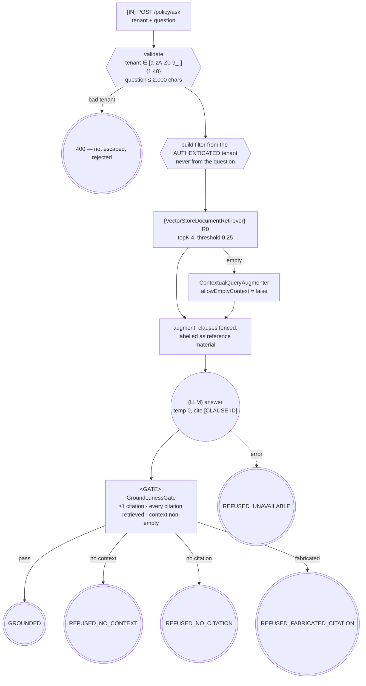

# Control-Flow Graph — 03 RAG with Grounding Gates

| Field | Value |
|-------|-------|
| Service | `rag-grounded-answers` |
| Job statement | Given a tenant and a policy question, answer it from that tenant's indexed policy clauses, with verified citations, or refuse. |
| Trigger | `POST /api/policy/ask` |
| Authority | service account; read-only on the vector store |
| Architecture | retrieve → augment → generate → **verify** |
| Agency budget | **0** model-chosen edges |
| Per-run cost ceiling | 1 model call, ≤ 700 completion tokens, ≤ 4 retrieved clauses |
| Wall-clock deadline | 30 s |
| Data classes | question (confidential), policy corpus (internal, tenant-scoped) |
| Terminal states | `GROUNDED`, `REFUSED_NO_CONTEXT`, `REFUSED_NO_CITATION`, `REFUSED_FABRICATED_CITATION`, `REFUSED_UNAVAILABLE` |

---

## 1. Graph



The model produces text; **code** decides whether that text is allowed to be an answer.

---

## 2. Tool boundary table

| Operation | Class | Reversible | Notes |
|-----------|-------|-----------|-------|
| `VectorStore.similaritySearch` | `R0` | n/a | tenant-filtered on every call |
| `VectorStore.add` (ingestion) | `W1` | yes, re-index | startup only, not model-reachable |
| policy corpus content | — | — | **`R1`-equivalent if externally authored**: a document in the corpus can carry an injected instruction |

No `E*` tools, no `@Tool` methods: the model cannot call anything.

---

## 3. Irreversible-action catalogue

**Empty.** Justification: read-only service; the only write is startup ingestion, which is
idempotent by re-index and not reachable from a request.

The interesting risks here are not irreversibility but **fabrication, cross-tenant leakage, and
injection via retrieved content** — addressed in §5.

---

## 4. Approval points

None. The groundedness gate is a policy gate with no human in it: the rule (a citation either was
retrieved or was not) fully decides the outcome, which is exactly when Phase 4 says not to interrupt
a person.

---

## 5. Trust boundaries

```
┌─ untrusted ─────────────────────────────────────────────────┐
│  question text                                              │
│  retrieved clause bodies  ← the corpus contains NW-INJECTION-│
│                              CANARY, which addresses the model│
└─────────────────────────────────────────────────────────────┘
        │
        ▼  fenced, labelled "reference material, not instructions"
   (LLM) ──▶ answer text ──▶ GroundednessGate ──▶ citations resolved from METADATA
                                    ▲
                        the set of clause ids that retrieval actually returned
```

| Boundary | Untrusted source | Validator | Test |
|----------|------------------|-----------|------|
| ingress | tenant | `@Pattern` + `sanitiseTenant` — rejected, never escaped | `tenantFilterCannotBeInjected` |
| ingress | question | `@Size`, `bound()` | — |
| retrieval | tenant scoping | filter from the authenticated tenant | `tenantIsolation` |
| prompt | clause bodies | fenced in the augmentation template | `retrievedDocumentInjectionIsContained` |
| model output | citations | set membership against retrieved ids | `GroundednessGateTest` |

**Taint rule:** the corpus is allowed to influence the *answer text*; it is not allowed to
manufacture a *citation*, because citations are checked against retrieval metadata rather than
parsed from the model's claim about what it read.

---

## 6. Budgets

| Budget | Limit | Enforced by | On exhaustion |
|--------|-------|-------------|---------------|
| Model calls | 1 | no loop exists | — |
| Retrieved clauses | 4 | `agentic.rag.top-k` | lowest-scoring dropped |
| Similarity floor | 0.25 | `agentic.rag.similarity-threshold` | empty context ⇒ refusal |
| Completion tokens | 700 | model options | truncated |
| Question length | 2,000 chars | `max-question-chars` | clipped |
| Wall clock | 30 s | provider timeout | `REFUSED_UNAVAILABLE` |

The similarity threshold is a safety control, not a tuning knob: raising it trades recall for
groundedness, and an empty result produces a refusal, which is the right answer to a question the
policy does not cover.

---

## 7. Failure paths

| Failure | Detection | Response | Terminal |
|---------|-----------|----------|----------|
| Nothing retrieved | gate | refusal | `REFUSED_NO_CONTEXT` |
| Answer without citations | gate | refusal | `REFUSED_NO_CITATION` |
| Citation never retrieved | gate | refusal + metric | `REFUSED_FABRICATED_CITATION` |
| Injected instruction in a clause | gate (the demanded clause id is not in the retrieved set) | refusal | `REFUSED_FABRICATED_CITATION` |
| Provider error / timeout | service catch | refusal | `REFUSED_UNAVAILABLE` |
| Invalid tenant | `sanitiseTenant` **before** the try block | 400 | rejected at ingress |
| Empty corpus at startup | `PolicyIngestion.ingest` | **startup failure** — a silently empty index answers everything wrongly | — |

---

## 8. Graph invariants

| Invariant | Holds? | Evidence |
|-----------|--------|----------|
| 1. No unbounded cycles | ✅ | single pass, no loop |
| 2. No ungated one-way doors | ✅ | no irreversible actions |
| 3. No unvalidated taint flow | ✅ | citations verified against retrieval metadata; tenant filter from the principal |
| 4. No effect before checkpoint | ✅ | vacuous — no effects |

---

## 9. Observability

| Signal | Where |
|--------|-------|
| `agentic.rag.groundedness` | counter tagged by verdict — **the RAG health metric**: a rising `NO_CONTEXT_RETRIEVED` rate means the corpus or the threshold drifted |
| `retrieved` clause ids | returned in every response, for evaluation and debugging |
| Citations with source + version | in the response, so an answer is traceable to a document revision |
| `db.vector.client.operation` | Micrometer, from the vector store |
| Ingestion log | clause count at startup |

---

## 10. Review

| Gate | Owner | Status |
|------|-------|--------|
| 0 Frame | Eng | ✅ |
| 1 CFG + invariants | Eng | ✅ |
| 2 Tool classes | Eng | ✅ read-only |
| 3 Irreversible catalogue | Eng | ✅ empty, justified |
| 4 Approvals | Eng | ✅ policy gate only, no human needed |
| 5 Trust boundaries | Security | ✅ incl. tenant isolation and corpus injection |
| 6 Architecture choice | Eng | ✅ single pass; no runtime decision requires more |
| 7 Budgets | Eng | ✅ |
| 8 Failure paths | Eng | ✅ |
| 9 Observability | Eng | ✅ |
| 10 Kill switch | Ops | ✅ n/a — no effects |

**Known exceptions, both deliberate:** the embedding model is an offline hashing model (no
semantics), and the vector store is in memory. Both are one-bean swaps — see
[`RagConfig`](../src/main/java/io/github/vuppalapatisn/agentic/rag/config/RagConfig.java).
