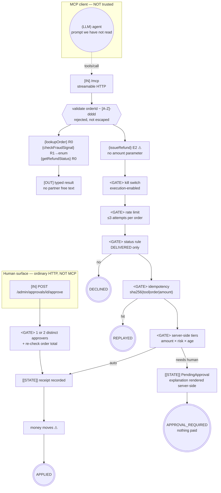

# Control-Flow Graph — 04 MCP Server

| Field | Value |
|-------|-------|
| Service | `mcp-server-tools` (port 8084, endpoint `/mcp`) |
| Job statement | Publish refund tools over MCP to agents we do not control, and enforce refund policy server-side. |
| Trigger | MCP `tools/call` over streamable HTTP; `POST /admin/approvals/{id}/approve` for the human decision |
| Authority | service account: read orders, write the refund ledger. The MCP caller's authority is **not** used for authorisation, only for rate limiting and audit. |
| Architecture | tool provider — **no LLM in this process** |
| Agency budget | **0** here. The model lives in the *client*, which is exactly why this server cannot rely on it. |
| Per-run cost ceiling | n/a (no model); 3 refund attempts per order per server |
| Data classes | order facts (PII), payment reference (regulated) |
| Terminal states | `APPLIED`, `REPLAYED`, `APPROVAL_REQUIRED`, `DECLINED`, `REFUSED` |

---

## 1. Graph



Two ingress nodes, deliberately on two different surfaces. **There is no path from the MCP
endpoint to the approval gate.**

---

## 2. Tool boundary table

| MCP tool | Class | `readOnlyHint` | `destructiveHint` | `idempotentHint` | Server controls |
|----------|-------|----------------|-------------------|------------------|-----------------|
| `lookupOrder` | `R0` | true | false | true | id pattern validated |
| `checkFraudSignal` | `R1` | true | false | true | partner response mapped to an enum; free text dropped |
| `getRefundStatus` | `R0` | true | false | true | — |
| `issueRefund` | `E2` ⚠ | false | **true** | true | kill switch, rate limit, status rule, idempotency, tiered policy |
| *approve* | — | — | — | — | **not published over MCP** |

The hints are accurate, and `McpServerContractTest` asserts that they stay accurate. They are a
**contract, not a control**: a client may use them to decide what needs confirmation, and a client
may ignore them entirely. Both facts are true at once, which is why the server enforces anyway.

---

## 3. Irreversible-action catalogue

| Field | `issueRefund` |
|-------|---------------|
| Class | `E2` |
| Blast radius | one customer, up to the order total |
| Detection latency | minutes (ledger reconciliation) |
| Compensation | **NONE in this project** — the server exposes no cancel tool, so the catalogue records no compensation rather than implying one |
| Approval | auto < \$100 & LOW & ≤30 d; single < \$1,000; **dual** ≥ \$1,000 or HIGH risk |
| Approval channel | **admin HTTP only** — never MCP |
| Idempotency key | `sha256("issueRefund\|" + orderId + "\|" + amountMinor)` |
| Rate limit | 3 attempts per order per server |
| Audit | `agentic.mcp.refund` counter tagged by outcome and rule |

---

## 4. Approval points

| # | Gate | Type | Where | Reachable from MCP? |
|---|------|------|-------|---------------------|
| 1 | kill switch | config | `ServerProperties.executionEnabled` | no |
| 2 | rate limit | server | per order | no |
| 3 | status rule | server | `DELIVERED` only | no |
| 4 | tiered policy | server | amount × risk × age | no |
| 5 | human approval | 1 or 2 distinct approvers | `/admin/approvals` | **no — by design** |

**Separation of duty.** The caller that requests an irreversible action must not be able to
authorise it. An `approveRefund` MCP tool would make gates 1–4 decorative, so
`McpServerContractTest.approvalIsNotExposedOverMcp` fails the build if one appears.

---

## 5. Trust boundaries

```
┌─ untrusted ────────────────────────────────────────────────┐
│  the MCP client itself: an agent, a prompt we have not     │
│  read, possibly influenced by text an attacker wrote       │
│  tool arguments                                            │
│  fraud provider response body                              │
└────────────────────────────────────────────────────────────┘
        │                                    │
        ▼                                    ▼
  validate(orderId)                 verdictOf(json) ──▶ FraudSignal enum
        │
        ▼
  server-side policy ──▶ APPROVAL_REQUIRED | DECLINED | APPLIED
```

| Boundary | Untrusted source | Validator | Test |
|----------|------------------|-----------|------|
| tool args | MCP client | `validOrderId` — rejects, does not escape | `orderIdIsValidated` |
| amounts | — | no amount parameter exists | `noValueParameters` |
| `R1` result | fraud provider | enum mapping | `fraudSignalIsAnEnum` |
| egress | tool results | typed records only, no partner free text | `Domain` |
| authorisation | MCP caller identity | used for rate limiting and audit **only** | `RefundDeskTest` |

**What this server publishes is also a boundary, in the other direction.** Tool descriptions and
the `instructions` string land inside someone else's model context. They are kept factual and free
of imperatives, because a description that says "always call this first" is indistinguishable from
prompt injection — and project 05 treats incoming descriptions as untrusted for exactly that reason.

---

## 6. Budgets

| Budget | Limit | Enforced by | On exhaustion |
|--------|-------|-------------|---------------|
| Refund attempts per order | 3 | `max-refund-attempts-per-order` | `REFUSED` |
| Request timeout | 20 s | `spring.ai.mcp.server.request-timeout` | transport error |
| Approvals per pending item | 1 or 2 distinct | `RefundDesk.approve` | `REFUSED` on duplicate approver |

No loops exist in this process — the loop is in the client, which is the client's budget to manage.

---

## 7. Failure paths

| Failure | Detection | Response |
|---------|-----------|----------|
| Unknown / malformed order id | `validOrderId` | `REFUSED` / `IllegalArgumentException` → MCP error |
| Execution disabled | kill switch | `REFUSED`; reads keep working |
| Repeated attempts | rate limit | `REFUSED` |
| Duplicate refund | idempotency key | `REPLAYED` with the original receipt |
| Duplicate approver on dual control | `approve` | `REFUSED` |
| Approval executed twice | `executed` flag | `REFUSED` |
| Order changed after approval raised | total re-checked at execution | `REFUSED` — stale approvals are not paid |
| Fraud provider unavailable | mapping default | `UNAVAILABLE` ⇒ not-low risk ⇒ never auto-approves |

---

## 8. Graph invariants

| Invariant | Holds? | Evidence |
|-----------|--------|----------|
| 1. No unbounded cycles | ✅ | no loop in this process; per-order attempt ceiling |
| 2. No ungated one-way doors | ✅ | `issueRefund` passes five server-side gates; the only path to payment above the automatic tier is the admin surface |
| 3. No unvalidated taint flow | ✅ | ids validated, no value parameters, `R1` → enum |
| 4. No effect before checkpoint | ✅ | receipt recorded under the idempotency key before returning |

---

## 9. Observability

| Signal | Where |
|--------|-------|
| `agentic.mcp.refund` | counter tagged `outcome` × `rule` — the server's own view of what callers achieved |
| Pending approvals | `GET /admin/approvals` |
| Rate-limit warnings | log, with the caller identity |
| Tool-list change notification | `spring.ai.mcp.server.tool-change-notification: true` so clients re-read rather than call a moved schema |

---

## 10. Review

| Gate | Owner | Status |
|------|-------|--------|
| 0 Frame | Eng | ✅ |
| 1 CFG + invariants | Eng | ✅ |
| 2 Tool classes + honest hints | Eng | ✅ contract-tested |
| 3 Irreversible catalogue | Eng + Ops | ✅ (compensation: NONE, stated) |
| 4 Approvals off the MCP surface | Security | ✅ contract-tested |
| 5 Trust boundaries (both directions) | Security | ✅ |
| 6 Architecture choice | Eng | ✅ tool provider; no model in-process |
| 7 Budgets | Eng | ✅ |
| 8 Failure paths | Eng | ✅ |
| 9 Observability | Eng | ✅ |
| 10 Kill switch | Ops | ✅ `agentic.mcp-server.execution-enabled` |

**Known exceptions:** state is in memory (approvals, receipts, rate-limit counters), and there is
no authentication on either surface — a real deployment needs both, plus per-client credentials so
that "caller identity" means something.
