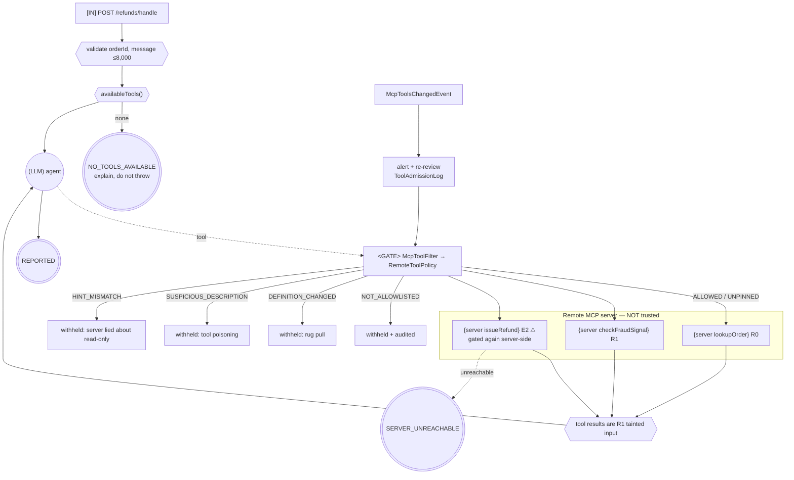

# Control-Flow Graph — 05 MCP Client with a Trust Boundary

| Field | Value |
|-------|-------|
| Service | `mcp-client-agent` (port 8085) |
| Job statement | Given a refund request, use tools published by a remote MCP server to resolve it, admitting only tools that local policy has reviewed. |
| Trigger | `POST /api/refunds/handle` |
| Authority | our service account for the model; **the remote server's authority for the effects** — a confused-deputy risk, recorded and scoped per server |
| Architecture | gated tool loop over a network trust boundary |
| Agency budget | **3** model-chosen edges (one per admitted remote tool) |
| Per-run cost ceiling | 10 tool calls; 1 call to the prefixed refund tool |
| Wall-clock deadline | 30 s model, 20 s per MCP request |
| Data classes | customer text (confidential); order facts cross a network boundary |
| Terminal states | `REPORTED`, `NO_TOOLS_AVAILABLE`, `SERVER_UNREACHABLE` |

---

## 1. Graph



The filter sits **before** the model sees a tool. A tool that is never offered cannot be called, and
its description never enters the context window.

---

## 2. Tool boundary table

| Remote tool | Our class | Server hint | Allowlisted | Prefixed name | Notes |
|-------------|-----------|-------------|-------------|---------------|-------|
| `lookupOrder` | `R0` | readOnly | ✅ | `refund-desk_lookupOrder` | pinned definition |
| `checkFraudSignal` | `R1` | readOnly, openWorld | ✅ | `refund-desk_checkFraudSignal` | result is tainted |
| `issueRefund` | `E2` ⚠ | destructive | ✅ | `refund-desk_issueRefund` | limit 1 call/run; gated again server-side |
| `getRefundStatus` | `R0` | readOnly | ❌ **deliberately not** | — | published by the server; we have no use for it, so the model never sees it |

The `expected-class` column in configuration is **our** classification. A server hint is evidence,
not authority.

---

## 3. Irreversible-action catalogue

| Field | `refund-desk_issueRefund` |
|-------|---------------------------|
| Class | `E2` |
| Blast radius | one customer, up to the order total — **in a system we do not operate** |
| Detection latency | whatever the server tells us; we cannot inspect its ledger |
| Compensation | none available to this client |
| Approval | the **server** decides and returns `APPROVAL_REQUIRED`; the human decides on the server's admin surface |
| Client-side controls | allowlist, pinned definition, name prefix, 1 call per run, and the agent is told not to retry |
| Audit | `agentic.mcp.tool.admission`; the server keeps the authoritative record |

**Honest limitation:** a client cannot make a remote action reversible. What it can do is refuse to
offer the tool, limit how often it is called, and not pretend that a server hint is a control. When
the irreversible effect lives elsewhere, the *server* must be the one that gates it — which is why
project 04 does.

---

## 4. Approval points

| # | Gate | Type | Where |
|---|------|------|-------|
| 1 | `RemoteToolPolicy` — allowlist | policy | client, before the model sees the tool |
| 2 | `RemoteToolPolicy` — pinned definition | policy | client |
| 3 | `RemoteToolPolicy` — description scan | policy | client |
| 4 | `RemoteToolPolicy` — hint mismatch | policy | client |
| 5 | framework tool-call limits | policy | client |
| 6 | **human approval of the refund** | human | **on the server** (project 04) |

Note the division of labour: the client controls *exposure*, the server controls *execution*.
Neither can do the other's job.

---

## 5. Trust boundaries

```
┌─ untrusted ──────────────────────────────────────────────────────────┐
│  customer message                                                    │
│  every remote TOOL DESCRIPTION   ← injected into OUR context window  │
│  every remote TOOL SCHEMA        ← can grow a parameter after review │
│  the remote TOOL LIST            ← can change after review (rug pull)│
│  every remote TOOL RESULT         ← R1 data from someone else's system│
└──────────────────────────────────────────────────────────────────────┘
        │
        ▼ McpToolFilter → RemoteToolPolicy (deny by default)
   (LLM) ──▶ tool call ──▶ remote server ──▶ result (data, never instruction)
```

| Risk | Control | Test |
|------|---------|------|
| Tool poisoning (instructions in a description) | description scanned for instruction shapes; withheld | `instructionShapedDescriptionIsWithheld` |
| Rug pull (list, schema or description changes) | definition fingerprint pinned; `McpToolsChangedEvent` alerts | `changedDescriptionIsWithheld`, `changedSchemaIsWithheld` |
| Name collision across servers | per-server prefix via `McpToolNamePrefixGenerator` | `serverIsPartOfTheIdentity` |
| Over-broad server | allowlist; `getRefundStatus` excluded | `allowlistIsExplicit` |
| Dishonest hints | our classification wins | `hintMismatchIsWithheld` |
| Confused deputy | one credential scope per server; server enforces its own policy | project 04 |
| Instruction inside a tool result | system prompt labels results as data; no result selects a tool | `prompts/remote-agent-system.st` |

---

## 6. Budgets

| Budget | Limit | Enforced by | On exhaustion |
|--------|-------|-------------|---------------|
| Total tool calls | 10 | `spring.ai.tools.limits` | `RETURN_ERROR_RESPONSE` |
| `refund-desk_issueRefund` | 1 | per-tool limit | error response to the model |
| MCP request timeout | 20 s | `spring.ai.mcp.client.request-timeout` | degrade |
| Model wall clock | 30 s | provider timeout | `SERVER_UNREACHABLE` |
| Tools admitted | allowlist size (3) | `RemoteToolPolicy` | n/a |

---

## 7. Failure paths

| Failure | Detection | Response | Terminal |
|---------|-----------|----------|----------|
| Server down / not started | no `ToolCallbackProvider` callbacks | explain, attempt nothing | `NO_TOOLS_AVAILABLE` |
| Every tool withheld | filter | same, with a withheld count | `NO_TOOLS_AVAILABLE` |
| Server error mid-run | exception | explain, attempt nothing further | `SERVER_UNREACHABLE` |
| Server returns `APPROVAL_REQUIRED` | tool result | report the approval id and stop | `REPORTED` |
| Tool list changes mid-flight | `McpToolsChangedEvent` | alert, re-evaluate on next admission | — |
| Definition changed | fingerprint mismatch | withheld (fail-closed on) | — |

---

## 8. Graph invariants

| Invariant | Holds? | Evidence |
|-----------|--------|----------|
| 1. No unbounded cycles | ✅ | framework total and per-tool limits; agent told not to retry |
| 2. No ungated one-way doors | ✅ | client gates exposure (four rules); server gates execution |
| 3. No unvalidated taint flow | ✅ | descriptions scanned and never in the system prompt; results labelled as data; no value parameters exist to fill |
| 4. No effect before checkpoint | ✅ (delegated) | the effect and its checkpoint both live on the server |

---

## 9. Observability

| Signal | Where |
|--------|-------|
| `agentic.mcp.tool.admission` | counter by server × tool × verdict — **the trust-boundary health metric** |
| `agentic.mcp.tool.list.changed` | counter by server — alert on this |
| `GET /api/mcp/tools` | every admission with the **observed fingerprint**, which is how you pin a new server |
| `GET /api/mcp/withheld` | the review queue |
| Withheld-tool warnings | log, per decision |

---

## 10. Review

| Gate | Owner | Status |
|------|-------|--------|
| 0 Frame | Eng | ✅ |
| 1 CFG + invariants | Eng | ✅ |
| 2 Tool classes (ours, not the server's) | Eng | ✅ |
| 3 Irreversible catalogue | Eng | ✅ with a stated limitation: a client cannot make a remote effect reversible |
| 4 Gate placement | Security | ✅ client gates exposure, server gates execution |
| 5 Trust boundaries | Security | ✅ poisoning, rug pull, collision, hints |
| 6 Architecture choice | Eng | ✅ |
| 7 Budgets | Eng | ✅ |
| 8 Failure paths incl. degraded mode | Eng | ✅ |
| 9 Observability | Eng | ✅ |
| 10 Kill switch | Ops | ✅ empty the allowlist, or `spring.ai.mcp.client.enabled=false` |

**Known exception:** the shipped configuration has `fail-closed-on-change: false` and blank
fingerprints, so tools are admitted as `UNPINNED`. That is the honest first-contact state — you
cannot pin a definition you have never seen. The documented workflow is connect → read
`GET /api/mcp/tools` → review → pin → set `fail-closed-on-change: true`. A deployment still sitting
at `UNPINNED` has skipped the review, and the metric makes that visible.
