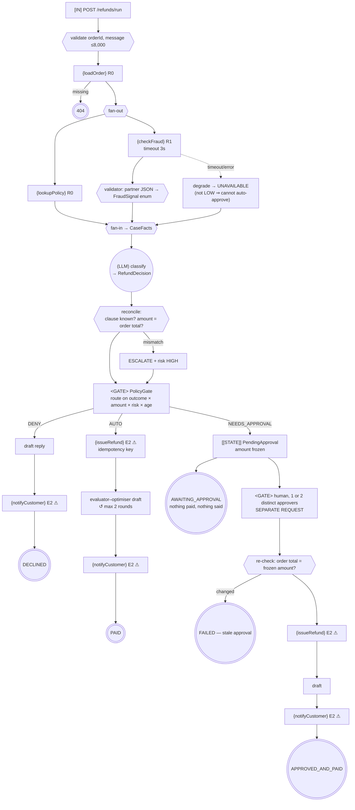

# Control-Flow Graph — 06 Workflow Orchestration

| Field | Value |
|-------|-------|
| Service | `workflow-orchestration` (port 8086) |
| Job statement | Given a refund request, gather facts, classify it, and — subject to a policy gate — refund and notify. |
| Trigger | `POST /api/refunds/run`; `POST /api/approvals/{id}/approve` for the resume |
| Authority | service account: read orders and policy, call the fraud provider, write the ledger, send templated notifications |
| Architecture | **workflow** — a fixed DAG in ordinary Java |
| Architecture justification | Steps and order are known at design time. There is no runtime decision that code cannot make: the one judgement (what does this complaint mean?) is a *classification*, so it lives inside a node. |
| Agency budget | **0** |
| Per-run cost ceiling | 1 classification + ≤4 drafting/critique calls |
| Wall-clock deadline | 30 s per model call, 3 s per parallel branch |
| Data classes | customer text (confidential), order + email (PII), payment reference (regulated) |
| Terminal states | `PAID`, `DECLINED`, `AWAITING_APPROVAL`, `APPROVED_AND_PAID`, `REJECTED`, `FAILED` |

---

## 1. Graph

Every edge out of a model node is deterministic. `agency = 0`.

---

## 2. The four workflow patterns

| Pattern | Where | Decided by |
|---------|-------|-----------|
| **Chain** | `RefundWorkflow.run` stage sequence | code |
| **Parallel fan-out/fan-in** | `FactGathering.gather` — policy ∥ fraud | code |
| **Routing** | `switch (gate.outcome())` | code |
| **Evaluator–optimiser** | `ReplyDrafter` — draft → critique → revise, ≤2 rounds | code (bound), model (content) |

An agent loop cannot make the parallel win, because it does not know in advance that the two
lookups are independent. A workflow does, because you told it.

---

## 3. Tool boundary table

| Operation | Class | Reversible | Idempotency key | Dry-run | Notes |
|-----------|-------|-----------|-----------------|---------|-------|
| `loadOrder` | `R0` | n/a | — | n/a | id pattern validated |
| `lookupPolicy` | `R0` | n/a | — | n/a | deterministic; project 03 does the retrieval version |
| `checkFraud` | `R1` | n/a | — | n/a | **tainted**; mapped to an enum, degrades to `UNAVAILABLE` |
| `issueRefund` | `E2` ⚠ | no | `sha256(run\|effect\|order\|amount)` | yes | amount from the order record |
| `notifyCustomer` | `E2` ⚠ | **no** | — (single send per run) | yes | recipient from the order record, allowlisted |

---

## 4. Irreversible-action catalogue

| Field | `issueRefund` | `notifyCustomer` |
|-------|---------------|------------------|
| Class | `E2` | `E2` |
| Blast radius | one customer, up to the order total | one customer, reputational |
| Detection latency | minutes | immediate |
| Compensation | not implemented here — **project 07 has the saga** | **NONE** |
| Approval | auto < \$100 & LOW & ≤30 d; single < \$1,000; dual ≥ \$1,000 or HIGH | inherits the branch |
| Idempotency key | `sha256(runId\|issueRefund\|orderId\|amountMinor)` | n/a |
| Dry-run | yes (`agentic.workflow.dry-run`) | yes |
| Ordering | **first** | **last** — least reversible effect goes last, so a payout failure means nothing was said |

---

## 5. Approval points

| # | Gate | Type | Rule | On reject |
|---|------|------|------|-----------|
| 1 | `PolicyGate` | policy | tiered; `DENY` for not-delivered or classified decline | `DECLINED` |
| 2 | `ApprovalDesk` | human ×1 | `SINGLE_APPROVER_DEFAULT`, `CLASSIFIER_ESCALATED` | stays pending |
| 3 | `ApprovalDesk` | human ×2 | `DUAL_CONTROL_HIGH_VALUE_OR_RISK` | stays pending |

| Property | Status |
|----------|--------|
| Durable | ❌ **in memory, and a workflow has nowhere to wait** — see below |
| Frozen | ✅ amount stored on the approval and re-checked against the order at execution |
| Attributed | ✅ approver list, duplicate approver refused |
| Bounded | ❌ **no expiry** — project 07 adds the timer |
| Replay-safe | ✅ single-use `consume` |
| Legible | ✅ `PolicyGate` renders the explanation from trusted data |
| Refusable | ⚠️ a rejection path exists at the API level but is not a persisted state here |

**This is the architecture showing its limit.** A workflow is a function call: it runs to completion
and returns. It has nowhere to *be* while a human takes a day, so the pending decision is parked in
a side store and picked up by an unrelated second request. If approvals are routine rather than
exceptional, that is the signal to move to a state machine — which is exactly what
[project 07](../../07-state-machine-orchestration/) does.

---

## 6. Trust boundaries

| Boundary | Untrusted source | Validator | Test |
|----------|------------------|-----------|------|
| ingress | HTTP body | Bean Validation + `loadOrder` pattern | `orderIdIsValidated` |
| prompt | customer message | fenced, labelled as data, clipped to 8,000 chars | `CaseClassifier` |
| `R1` result | fraud provider | enum mapping, unknown ⇒ `UNAVAILABLE` | `fraudResultIsAnEnum` |
| model output | clause id | must be one of the supplied clauses | `fabricatedClauseEscalates` |
| model output | amount | must equal the order total | `amountMismatchEscalates` |
| model output | customer prose | forbidden-phrase check **after** the critic | `deterministicCheckBeatsTheCritic` |
| egress | recipient | allowlist in `RefundEffects` | `RefundEffects` |

---

## 7. Budgets

| Budget | Limit | Enforced by | On exhaustion |
|--------|-------|-------------|---------------|
| Classification calls | 1 | no loop | — |
| Drafting rounds | 2 | `ReplyDrafter.MAX_ROUNDS` | last draft still checked; safe template if unsafe |
| Parallel branch | 3 s | `FactGathering.BRANCH_TIMEOUT` | policy fails the run; fraud degrades |
| Model call | 30 s | provider timeout | `FAILED` with a safe reply |
| Completion tokens | 700 / 400 | per-client options | truncated |

---

## 8. Failure paths

| Failure | Detection | Response | Terminal |
|---------|-----------|----------|----------|
| Unknown order | `loadOrder` | 404, no model call | — |
| Policy branch fails | `join` | run fails | `FAILED` |
| Fraud branch fails | `joinOrDefault` | degrade to `UNAVAILABLE` | continues |
| Unparseable classification | `entity()` throws | `ESCALATE` | `AWAITING_APPROVAL` |
| Amount / clause mismatch | `reconcile` | `ESCALATE`, order total applies | `AWAITING_APPROVAL` |
| Critic approves an unsafe draft | forbidden-phrase check | safe template | continues |
| Duplicate resume | single-use `consume` | refused | — |
| Same approver twice | `approve` | refused | — |
| Order changed after approval | total re-checked | nothing paid | `FAILED` |
| Any other exception | workflow catch | safe reply, step recorded | `FAILED` |

---

## 9. Graph invariants

| Invariant | Holds? | Evidence |
|-----------|--------|----------|
| 1. No unbounded cycles | ✅ | the only loop is `ReplyDrafter`, bound 2, with a checked exit |
| 2. No ungated one-way doors | ✅ | every path to `issueRefund` passes `PolicyGate`; the approval path additionally re-checks the amount |
| 3. No unvalidated taint flow | ✅ | `R1` → enum; clause and amount reconciled; no value parameters |
| 4. No effect before checkpoint | ⚠️ partial — the idempotency key is computed and checked before the effect, but there is no durable run record. Project 07 fixes this. |

---

## 10. Observability

| Signal | Where |
|--------|-------|
| `steps` | every response carries the executed step list — the workflow's own trace |
| `agentic.workflow.effect` | counter by effect × outcome (`APPLIED`/`REPLAYED`/`DRY_RUN`) |
| `gateRule` | on every response, so a decision is explainable |
| Drafting rounds | in the step name: `draftReply(rounds=2)` |

---

## 11. Review

| Gate | Owner | Status |
|------|-------|--------|
| 0 Frame | Eng | ✅ |
| 1 CFG + invariants | Eng | ✅ (invariant 4 partial, stated) |
| 2 Tool classes | Eng | ✅ |
| 3 Irreversible catalogue | Eng + Ops | ✅ (no compensation here; project 07) |
| 4 Approvals | Eng | ⚠️ **not durable, no expiry** — accepted limitation of this architecture |
| 5 Trust boundaries | Security | ✅ |
| 6 Architecture choice | Eng | ✅ workflow, with the reason stated above |
| 7 Budgets | Eng | ✅ |
| 8 Failure paths | Eng | ✅ |
| 9 Observability | Eng | ✅ |
| 10 Kill switch | Ops | ✅ `agentic.workflow.dry-run` |

**Migration trigger recorded:** if a pending approval must survive a restart, or an unanswered
approval must expire, this design has outgrown a workflow. Move to
[07](../../07-state-machine-orchestration/).
