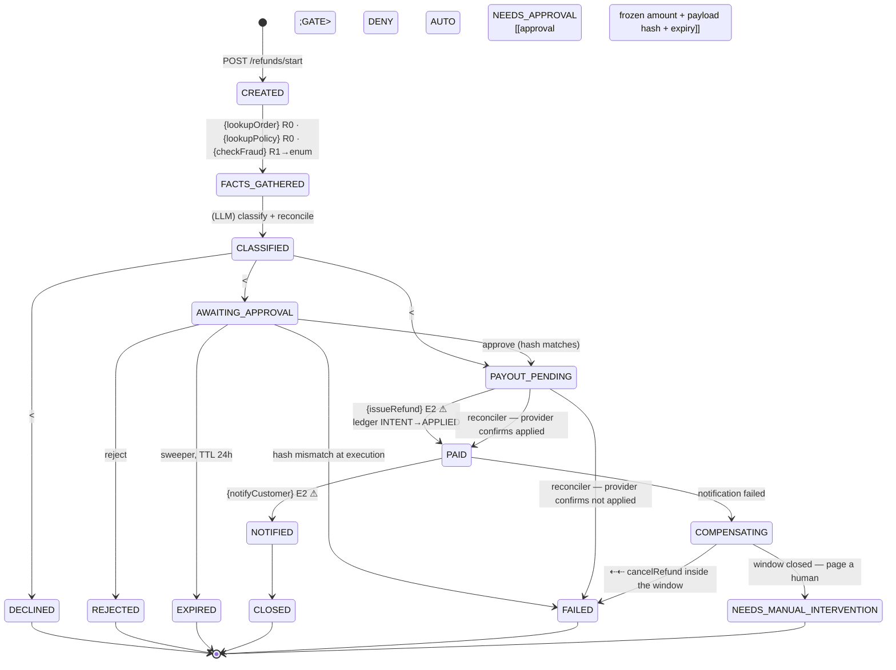

# Control-Flow Graph — 07 State Machine Orchestration

| Field | Value |
|-------|-------|
| Service | `state-machine-orchestration` (port 8087, H2 at `./data/refund-runs`) |
| Job statement | Same as project 06: gather facts, classify, and — subject to a policy gate and possibly a human — refund and notify. |
| Trigger | `POST /api/refunds/start`; `/approvals/{id}/approve|reject`; `/runs/{id}/advance`; two sweepers |
| Authority | service account: read orders, call the fraud provider, write the ledger, send templated notifications |
| Architecture | **state machine** — states are rows, transitions are guarded and audited |
| Architecture justification | Runs outlast a request: a human may take a day. The approval must survive a restart, expire on a timer, and be audited per transition; and a crash between intent and effect must be reconcilable. None of that fits a function call. |
| Agency budget | **0** |
| Per-run cost ceiling | **1** model call (the customer reply is a template here) |
| Wall-clock deadline | 30 s per model call; approval TTL 24 h |
| Data classes | customer text (confidential), order + email (PII), payment reference (regulated) |
| Terminal states | `CLOSED`, `DECLINED`, `REJECTED`, `EXPIRED`, `FAILED`, `NEEDS_MANUAL_INTERVENTION` |

---

## 1. Graph

The transition table lives in
[`RunState.allowedNext()`](../src/main/java/io/github/vuppalapatisn/agentic/statemachine/domain/RunState.java);
a move outside it throws rather than writing a row.

---

## 2. What the states are for

| State | Exists because |
|-------|----------------|
| `AWAITING_APPROVAL` | the run needs somewhere to **be** for a day; it must survive a restart and be able to expire |
| `PAYOUT_PENDING` | a crash between recording intent and learning the outcome must leave a state a sweeper can **reconcile** — the durable form of "no effect before checkpoint" |
| `COMPENSATING` | unwinding is a position, not a `catch` block |
| `NEEDS_MANUAL_INTERVENTION` | compensation that is no longer possible must **page a human**, not blend into `FAILED` |

---

## 3. Tool boundary table

| Operation | Class | Reversible | Idempotency key | Notes |
|-----------|-------|-----------|-----------------|-------|
| `loadOrder` / `policyClauses` | `R0` | n/a | — | id pattern validated |
| `checkFraud` | `R1` | n/a | — | mapped to an enum; unknown ⇒ `UNAVAILABLE` |
| `provider.pay` | `E2` ⚠ | until settlement | `sha256(run\|issueRefund\|order\|amount)` | key is passed to the provider |
| `provider.cancel` | `E1` | — | same key | compensation, window-limited |
| `provider.notifyCustomer` | `E2` ⚠ | **no** | — | allowlisted recipient, template body |

---

## 4. Irreversible-action catalogue

| Field | `issueRefund` | `notifyCustomer` |
|-------|---------------|------------------|
| Class | `E2` | `E2` |
| Blast radius | one customer, up to the order total | one customer, reputational |
| Detection latency | reconciler runs every minute | immediate |
| Compensation | `provider.cancel` | **NONE** |
| Window | `agentic.state-machine.settlement-delay` (30 min), stored per run as `settles_at` | — |
| Window enforcement | `RefundRun.compensable(now)` and the provider's own check | — |
| Approval | auto < \$100 & LOW & ≤30 d; single < \$1,000; dual ≥ \$1,000 or HIGH |
| Idempotency key | `Hashing.idempotencyKey(...)`, persisted on the run **before** the effect |
| Audit | `run_transition` row per move, plus `refund_effect` phases |

---

## 5. Approval points — all seven properties, as storage facts

| Property | How | Test |
|----------|-----|------|
| **Durable** | a `run_approval` row + the run's `AWAITING_APPROVAL` state | `approvalStateIsDurable` |
| **Frozen** | `amount_minor` + `payload_hash`, re-checked by `consume` | `approvalExecutesTheFrozenPayload` |
| **Attributed** | `approvers` column; repeat approver refused | `dualControl` |
| **Bounded** | `expires_at` + the expiry sweeper; **never auto-approves** | `expirySweeperNeverPays` |
| **Replay-safe** | status → `EXECUTED` once, plus the idempotency ledger | `duplicateApprovalIsRefused` |
| **Legible** | `explanation`, rendered by `PolicyGate` from trusted data | `PolicyGate` |
| **Refusable** | `REJECTED` is a terminal run state | `rejectionIsTerminal` |

**No model turn between approval and execution.** `approve()` re-reads the persisted run and moves
it to `PAYOUT_PENDING`; nothing is re-classified. `approvalExecutesTheFrozenPayload` asserts the
model was called exactly **once** for the whole run.

---

## 6. Trust boundaries

| Boundary | Untrusted source | Validator | Test |
|----------|------------------|-----------|------|
| ingress | HTTP body | Bean Validation + `loadOrder` pattern | — |
| prompt | customer message | fenced, labelled as data, clipped | `CaseClassifier` |
| `R1` result | fraud provider | enum mapping | `FactGathering` |
| model output | clause id | must be one of the supplied clauses | — |
| model output | amount | must equal the order total | `amountMismatchEscalates` |
| state | any caller | guarded transition: table + expected-state check | `illegalTransitionIsRejected`, `guardedTransitionLosesTheRace` |
| approval | resume caller | payload hash must match | `ApprovalRepository.consume` |
| egress | recipient | allowlist | `RefundProvider` |

The state column is itself a trust boundary here: **nothing mutates it except
`RunRepository.transition`**, which checks both the transition table and the expected current state.

---

## 7. Budgets

| Budget | Limit | Enforced by | On exhaustion |
|--------|-------|-------------|---------------|
| Model calls | 1 per run | no loop | — |
| Approval TTL | 24 h | `approval-ttl` + sweeper | `EXPIRED` (never approved) |
| Compensation window | 30 min | `settlement-delay`, stored as `settles_at` | `NEEDS_MANUAL_INTERVENTION` |
| Reconcile delay | 2 min | `reconcile-after` + sweeper | run resolved either way |
| Sweep interval | 1 min | `sweep-interval` | — |
| Advance iterations | one transition per iteration, stops when nothing moved | `advance()` loop | no silent spin |

---

## 8. Failure paths

| Failure | Detection | Response | Terminal |
|---------|-----------|----------|----------|
| Provider error during payout | exception, ledger stays `INTENT` | run stays `PAYOUT_PENDING` for the reconciler | — |
| **Lost acknowledgement** (provider applied, we did not learn) | reconciler asks by idempotency key | → `PAID`, continue | `CLOSED` |
| Provider confirms no payment | reconciler | → `FAILED`, no blind retry | `FAILED` |
| Notification fails after payment | exception | → `COMPENSATING` | `FAILED` |
| Compensation window closed | provider check | → `NEEDS_MANUAL_INTERVENTION` | pages a human |
| Approval unanswered | expiry sweeper | → `EXPIRED` | `EXPIRED` |
| Approval rejected | API | → `REJECTED` | `REJECTED` |
| Payload hash mismatch at execution | `consume` | → `FAILED`, nothing paid | `FAILED` |
| Concurrent transition | expected-state check | the loser is told it lost | — |
| Unparseable classification | `entity()` throws | `ESCALATE` → approval | `AWAITING_APPROVAL` |
| Restart mid-run | state is a row | `POST /runs/{id}/advance` resumes | — |

---

## 9. Graph invariants

| Invariant | Holds? | Evidence |
|-----------|--------|----------|
| 1. No unbounded cycles | ✅ | `advance()` performs one transition per iteration and stops when nothing moved |
| 2. No ungated one-way doors | ✅ | the only routes into `PAYOUT_PENDING` are the `AUTO` gate and a hash-verified approval |
| 3. No unvalidated taint flow | ✅ | `R1` → enum; clause and amount reconciled; the gate reads only trusted values |
| 4. No effect before checkpoint | ✅ **fully** — `PAYOUT_PENDING` + `refund_effect` `INTENT` are both written before the provider is called |

---

## 10. Observability

| Signal | Where |
|--------|-------|
| `GET /api/runs/{id}/transitions` | **the audit trail**: from, to, actor, reason, timestamp |
| `agentic.fsm.state` | counter by terminal state |
| `agentic.fsm.gate` | counter by rule × outcome |
| `agentic.fsm.approval` | counter, `EXPIRED` — watch this |
| `agentic.fsm.reconciliation` | counter, `APPLIED` / `NOT_APPLIED` — **a rise means the provider path is unhealthy** |
| `agentic.fsm.compensation` | counter, `SUCCEEDED` / `WINDOW_CLOSED` / `FAILED` |
| `agentic.fsm.payout.unresolved` | counter — runs left for the reconciler |
| `refund_effect` rows in `INTENT` | the reconciliation queue |

Replay is **reconstruct-from-storage**: the run row plus its transitions answer "why did run
`r-8831` pay \$240?" without re-running the model.

---

## 11. Review

| Gate | Owner | Status |
|------|-------|--------|
| 0 Frame | Eng | ✅ |
| 1 CFG + invariants | Eng | ✅ all four |
| 2 Tool classes | Eng | ✅ |
| 3 Irreversible catalogue | Eng + Ops | ✅ with a real compensation window |
| 4 Approvals — seven properties | Eng | ✅ all seven |
| 5 Trust boundaries | Security | ✅ incl. the state column |
| 6 Architecture choice | Eng | ✅ state machine, justified by durability + audit + compensation |
| 7 Budgets | Eng | ✅ |
| 8 Failure paths | Eng | ✅ incl. lost acknowledgement and closed window |
| 9 Observability | Eng | ✅ |
| 10 Kill switch | Ops | ✅ `agentic.state-machine.dry-run` |

**Known exceptions:** H2 rather than PostgreSQL (swap the datasource block); the sweepers are
single-node (a clustered deployment needs a lock or a leader); `run_transition` has no
grant-level protection in H2, which in production is the difference between an audit log and a
suggestion.
