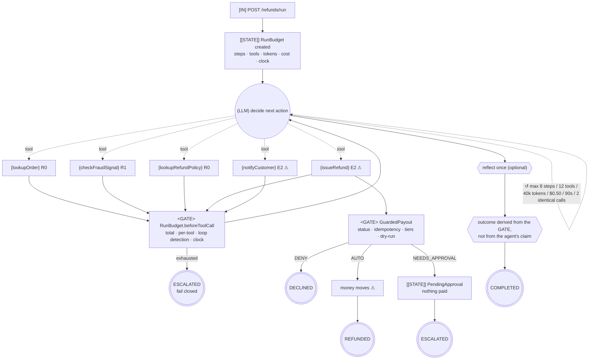

# Control-Flow Graph — 08 Autonomous Agent Loop

| Field | Value |
|-------|-------|
| Service | `autonomous-agent-loop` (port 8088) |
| Job statement | Same as projects 06/07: resolve a refund request — but the **model** decides what to investigate next. |
| Trigger | `POST /api/refunds/run` |
| Authority | service account: read orders and policy, call the fraud provider, write the ledger, send templated notifications |
| Architecture | **agent loop** — model-driven tool selection |
| Architecture justification | Kept deliberately weak, and stated as such: for *this* job a workflow is sufficient, and project 06 proves it. The loop earns its place only where the investigation path genuinely depends on findings (fraud triage over a wide tool surface). This project exists to show how to bound one. |
| Agency budget | **5** — one per exposed tool, every turn |
| Per-run cost ceiling | 8 steps · 12 tool calls · 40,000 tokens · \$0.50 · 90 s |
| Data classes | customer text (confidential), order + email (PII), payment reference (regulated) |
| Terminal states | `REFUNDED`, `COMPLETED`, `DECLINED`, `ESCALATED`, `FAILED` |

---

## 1. Graph



`agency = 5`. The loop is the architecture; the budgets and the gate are the engineering.

---

## 2. The budgets

| Budget | Limit | Enforcement point | On exhaustion |
|--------|-------|-------------------|---------------|
| `STEPS` | 8 model turns | `BudgetAdvisor.before` → `RunBudget.beginStep` | `ESCALATED` |
| `TOTAL_TOOL_CALLS` | 12 | `RunBudget.beforeToolCall` | `ESCALATED` |
| `PER_TOOL_CALLS` | 3 default; **1** for `issueRefund`, `notifyCustomer` | same | `ESCALATED` |
| `TOKENS` | 40,000 | `BudgetAdvisor.after` → `recordUsage` | `ESCALATED` |
| `COST` | \$0.50 estimated | same | `ESCALATED` |
| `WALL_CLOCK` | 90 s | checked at every step and tool call | `ESCALATED` |
| `NO_PROGRESS` | 2 identical consecutive calls | `beforeToolCall` loop detection | `ESCALATED` |

**Every one fails closed.** `RunBudgetTest` drives each to exhaustion; `RefundAgentTest` proves a
runaway model is stopped and nothing is paid.

Three independent layers, protecting different things:

| Layer | Protects against | Blind to |
|-------|------------------|----------|
| `spring.ai.tools.limits.*` | runaway model loops, repeated calls | cost, wall clock, direct bean calls |
| `RunBudget` | cost, tokens, clock, no-progress, total steps | a single catastrophic call |
| `GuardedPayout` | a single catastrophic call | nothing — last line |

---

## 3. Tool boundary table

| Tool | Class | Reversible | Per-run ceiling | Notes |
|------|-------|-----------|-----------------|-------|
| `lookupOrder` | `R0` | n/a | 3 | id pattern validated |
| `checkFraudSignal` | `R1` | n/a | 3 | **tainted**; mapped to an enum |
| `lookupRefundPolicy` | `R0` | n/a | 3 | static clause text |
| `issueRefund` | `E2` ⚠ | no | **1** | no amount parameter; gate decides |
| `notifyCustomer` | `E2` ⚠ | **no** | **1** | template id only; recipient from the order |

The budget travels in the **tool context**, never as a tool parameter: the model must not be able to
influence the thing that limits it.

---

## 4. Irreversible-action catalogue

| Field | `issueRefund` | `notifyCustomer` |
|-------|---------------|------------------|
| Class | `E2` | `E2` |
| Blast radius | one customer, up to the order total | one customer, reputational |
| Compensation | not implemented here (project 07 has the saga) | **NONE** |
| Approval | auto < \$100 & LOW & ≤30 d; single < \$1,000; dual ≥ \$1,000 or HIGH |
| Idempotency key | `sha256(runId\|issueRefund\|orderId\|amountMinor)` — from the run, not the model |
| Per-run ceiling | 1 | 1 |
| Dry-run | yes | yes |

---

## 5. Approval points

| # | Gate | Type | Reachable by the model? |
|---|------|------|-------------------------|
| 1 | `RunBudget` (7 budgets) | policy | no — it is the thing limiting it |
| 2 | `GuardedPayout` status rule | policy | no |
| 3 | `GuardedPayout` idempotency | policy | no |
| 4 | `GuardedPayout` tiers | policy | no |
| 5 | human approval | 1 or 2 approvers | no — suspended, not performed |

The agent is *told* about the approval (`APPROVAL_REQUIRED` with an id) so it can report and stop.
Being told is not being able to grant.

---

## 6. Trust boundaries

| Boundary | Untrusted source | Validator |
|----------|------------------|-----------|
| ingress | HTTP body | Bean Validation |
| prompt | customer message | fenced, labelled as data |
| `R1` result | fraud provider | enum mapping |
| tool args | model output | `@Pattern`/`@NotBlank`; **no value parameters exist** |
| tool context | — | budget injected by the service, not the model |
| the agent's own report | model output | the outcome is derived from the gate's records, not the claim |
| egress | recipient | allowlist + template whitelist |

The last row is worth its own note. An agent that reports "I have refunded USD 240.00" when the gate
suspended the payout is a normal failure of this architecture, so
`outcomeComesFromTheGateNotTheClaim` asserts the response says `ESCALATED` with no receipt.

---

## 7. Failure paths

| Failure | Detection | Response | Terminal |
|---------|-----------|----------|----------|
| Any budget exhausted | `BudgetExceededException` | escalate, nothing paid | `ESCALATED` |
| Runaway identical calls | loop detection | escalate after 2 | `ESCALATED` |
| Gate declines | status rule | reported to the agent | `DECLINED`/`COMPLETED` |
| Gate suspends | tiers | approval created, nothing paid | `ESCALATED` |
| Unknown template / bad recipient | `GuardedPayout` | recoverable message to the model, nothing sent | continues |
| Unbudgeted run (programming error) | advisor + tools | `IllegalStateException` — refuse to run | `FAILED` |
| Model/provider error | catch-all | safe reply | `FAILED` |
| Dry run | kill switch | every effect refused | `COMPLETED` |

---

## 8. Graph invariants

| Invariant | Holds? | Evidence |
|-----------|--------|----------|
| 1. No unbounded cycles | ✅ | seven budgets, each exhaustion-tested, all fail closed |
| 2. No ungated one-way doors | ✅ | `GuardedPayout` is inside the effect, not an advisor; no path around it |
| 3. No unvalidated taint flow | ✅ | `R1` → enum; no value parameters; budget not model-supplied |
| 4. No effect before checkpoint | ⚠️ partial — the idempotency key is derived and checked before the effect, but state is in memory. Project 07 is the durable version. |

---

## 9. Observability

Every response carries the receipt, because in this architecture it is the only way to know what a
run did:

```json
{ "outcome": "ESCALATED", "exhaustedBudget": "NO_PROGRESS",
  "modelTurns": 2, "toolCalls": 2, "totalTokens": 520, "estimatedCostMinor": 0,
  "elapsed": "PT0.01S", "trace": [ {"index":1,"kind":"LLM"}, {"index":2,"kind":"TOOL"} ] }
```

| Signal | Why |
|--------|-----|
| `agentic.agent.budget.exhausted` by budget | **the diagnostic**: `NO_PROGRESS` means stuck, `TOTAL_TOOL_CALLS` means the task is harder than the budget assumes, `COST` means look at the prompt |
| `agentic.agent.run` by outcome | escalation rate — watch the *change* |
| `agentic.agent.gate` by rule × outcome | what the gate actually decided |
| per-response `trace` | the step-by-step receipt |

---

## 10. Review

| Gate | Owner | Status |
|------|-------|--------|
| 0 Frame | Eng | ✅ |
| 1 CFG + invariants | Eng | ✅ (invariant 4 partial, stated) |
| 2 Tool classes | Eng | ✅ |
| 3 Irreversible catalogue | Eng + Ops | ✅ |
| 4 Gate outside the model's reach | Security | ✅ |
| 5 Trust boundaries | Security | ✅ incl. the agent's own claims |
| 6 **Architecture choice** | Eng | ⚠️ **downgrade candidate** — for this job, project 06 is sufficient. Recorded deliberately. |
| 7 Budgets | Eng | ✅ all seven, all exhaustion-tested |
| 8 Failure paths | Eng | ✅ |
| 9 Observability | Eng | ✅ |
| 10 Kill switch | Ops | ✅ `agentic.agent.dry-run` |

**Gate 6 is deliberately marked as a downgrade candidate.** A review that cannot name a runtime
decision code could not make should send an agent design back to a workflow, and for the refund job
there is no such decision. Keeping that honest in our own repo is the point.
