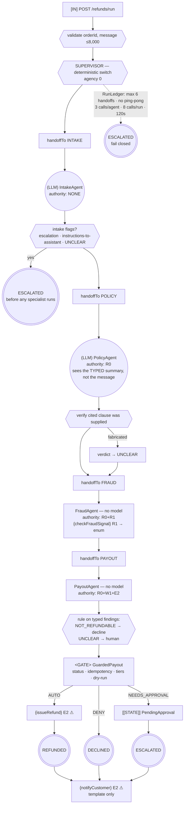

# Control-Flow Graph — 09 Multi-Agent Supervisor

| Field | Value |
|-------|-------|
| Service | `multi-agent-supervisor` (port 8089) |
| Job statement | Same as projects 06–08, split across four specialists with different authority. |
| Trigger | `POST /api/refunds/run` |
| Authority | **per agent**: intake none · policy `R0` · fraud `R0`+`R1` · payout `R0`+`W1`+`E2` |
| Architecture | **multi-agent**, supervisor as code (the hybrid recommended in `docs/02-ARCHITECTURE-COMPARISON.md` §6) |
| Architecture justification | The work splits by **authority**, not only by topic: the component that reads attacker-controlled text and the component that can move money must not be the same component. |
| Agency budget | **0** for routing (the supervisor is a `switch`); 2 model-decision nodes (intake, policy) |
| Per-run cost ceiling | 6 handoffs · 3 model calls per agent · 8 per run · 120 s |
| Data classes | customer text (confidential), order + email (PII), payment reference (regulated) |
| Terminal states | `REFUNDED`, `DECLINED`, `ESCALATED`, `FAILED` |

---

## 1. Graph



Note the shape of the escalation edge from intake: it leaves **before** any specialist runs, so a
message that tries to manipulate the system never reaches the agent that could act on it.

---

## 2. The authority map — the security model

| Agent | Role | Allowed classes | Capabilities | Blast radius if compromised |
|-------|------|-----------------|--------------|------------------------------|
| Intake | `INTAKE` | **none** | none | **nothing** — and it is the only agent that reads attacker-controlled text |
| Policy | `POLICY` | `R0` | `lookupPolicy` | a wrong clause citation, verified against the supplied list |
| Fraud | `FRAUD` | `R0`, `R1` | `lookupOrder`, `checkFraudSignal` | a wrong risk label; cannot write anything |
| Payout | `PAYOUT` | `R0`, `W1`, `E2` | `lookupOrder`, `issueRefund`, `notifyCustomer` | money — and it has **no model and no prompt surface** |

Enforced by `AgentCapabilities` at **startup**: a capability outside its role fails the
application, and a second effectful role fails it too. Served at `GET /api/agents/authority`.

> The two facts that make this work together: the agent that reads the attack has no power, and the
> agent with the power has no prompt.

---

## 3. Handoff contracts

| From → To | Contract | Closed vocabulary |
|-----------|----------|-------------------|
| Intake → Policy | `IntakeSummary` | `Complaint` enum, two booleans, one bounded sentence |
| Policy → Payout | `PolicyFinding` | `Verdict` enum + a clause id verified against the supplied list |
| Fraud → Payout | `RiskFinding` | `FraudSignal` + `RiskLevel` enums |
| Payout → Supervisor | `PayoutDecision` | verdict string from the gate, not from an agent |

**Another agent's output is `R1` tainted input.** Every contract is a typed record with no amount,
no recipient, no tool name and nothing instruction-shaped — that is what stops an injected
instruction travelling from the customer's text to the payout path inside a "notes" field.

Asserted by `rawMessageDoesNotCrossTheHandoff`: the injection appears in the intake agent's prompt
and **not** in the policy agent's.

---

## 4. Irreversible-action catalogue

| Field | `issueRefund` | `notifyCustomer` |
|-------|---------------|------------------|
| Class | `E2` | `E2` |
| Held by | `PAYOUT` only | `PAYOUT` only |
| Blast radius | one customer, up to the order total | one customer, reputational |
| Compensation | not implemented here (project 07 has the saga) | **NONE** |
| Approval | auto < \$100 & LOW & ≤30 d; single < \$1,000; dual ≥ \$1,000 or HIGH |
| Idempotency key | `sha256(runId\|issueRefund\|orderId\|amountMinor)` — runId from the **supervisor** |
| Dry-run | yes | yes |

---

## 5. Approval and escalation points

| # | Gate | Decided by | Reached before any effect? |
|---|------|-----------|----------------------------|
| 1 | intake flags (escalation / instructions / unclear) | rule over a typed field | ✅ run stops at handoff 1 |
| 2 | policy `NOT_REFUNDABLE` | rule | ✅ |
| 3 | policy `UNCLEAR` | rule — unclear means ask a human, never pay | ✅ |
| 4 | `GuardedPayout` status + tiers | rule | ✅ |
| 5 | human approval, 1 or 2 approvers | person | — |

Only `PAYOUT` may escalate to a human (`AgentRole.mayEscalateToHuman`): the role that can act is
the role that may ask for authorisation to act.

---

## 6. Trust boundaries

```
┌─ untrusted ───────────────────────────────┐
│  customer message  → INTAKE only          │
│  fraud provider body → FRAUD only          │
│  every agent's own output → the next agent │
└───────────────────────────────────────────┘
        │                    │
        ▼                    ▼
  typed IntakeSummary   FraudSignal enum
        │                    │
        └──────▶ PAYOUT (no model) ──▶ rule ──▶ gate ──▶ effect
```

| Boundary | Validator | Test |
|----------|-----------|------|
| ingress | Bean Validation | — |
| customer text → intake | fenced, labelled as data, clipped | `IntakeAgent` |
| intake → policy | typed record; raw text does not cross | `rawMessageDoesNotCrossTheHandoff` |
| policy output | cited clause must be one we supplied | `fabricatedClauseIsNotTrusted` |
| fraud `R1` | enum mapping, `UNAVAILABLE` on failure | `OrderDirectory` |
| payout inputs | rule over typed findings; **no model** | `PayoutAgent` |
| egress | allowlist + template whitelist | `GuardedPayout` |
| authority | startup validation | `AgentAuthorityTest` |

---

## 7. Budgets and termination rules

| Rule | Limit | Why multi-agent needs it |
|------|-------|--------------------------|
| `MAX_HANDOFFS` | 6 | a run that keeps delegating |
| `PING_PONG` | A→B→A refused | impossible with a code supervisor; **the control exists for the day somebody makes the supervisor a model** |
| `MAX_AGENT_CALLS` | 3 | one specialist must not burn the whole run |
| `MAX_RUN_CALLS` | 8 | run-wide ceiling on top of the per-agent one |
| `WALL_CLOCK` | 120 s | this is the slowest architecture; budget for it |

All fail closed to `ESCALATED`. `RunLedgerTest` drives each rule.

---

## 8. Failure paths

| Failure | Detection | Response | Terminal |
|---------|-----------|----------|----------|
| Intake flags manipulation | typed boolean | escalate at handoff 1, nothing else runs | `ESCALATED` |
| Unparseable intake output | `entity()` throws | `UNCLEAR` → human | `ESCALATED` |
| Policy agent fabricates a clause | verification | `UNCLEAR` → human | `ESCALATED` |
| Policy unclear | rule | human; **never pay** | `ESCALATED` |
| Fraud provider unavailable | mapping default | `UNAVAILABLE` (MEDIUM) ⇒ cannot auto-approve | continues |
| Gate declines | status rule | decline + notify | `DECLINED` |
| Gate suspends | tiers | approval, nothing paid | `ESCALATED` |
| Any termination rule | `TerminationException` | escalate | `ESCALATED` |
| Anything else | catch-all | safe reply | `FAILED` |

---

## 9. Graph invariants

| Invariant | Holds? | Evidence |
|-----------|--------|----------|
| 1. No unbounded cycles | ✅ | code supervisor + five termination rules, all tested |
| 2. No ungated one-way doors | ✅ | only `PAYOUT` holds the capability, and it goes through `GuardedPayout` |
| 3. No unvalidated taint flow | ✅ | typed handoffs; clause verification; `R1` → enum; payout has no model |
| 4. No effect before checkpoint | ⚠️ partial — idempotency key derived and checked before the effect, but state is in memory (project 07 is the durable version) |

---

## 10. Observability

| Signal | Why |
|--------|-----|
| `handoffs` in every response | the sequence of agents, in order |
| `blackboard` in every response | **who contributed what** — the multi-agent audit |
| `terminatedBy` | which rule stopped a run, when one did |
| `modelCalls`, `elapsed` | the cost receipt |
| `agentic.multiagent.terminated` by rule | the diagnostic: which failure mode is actually occurring |
| `agentic.multiagent.escalation` by reason | how often intake flags manipulation |
| `agentic.multiagent.gate` by rule | what the gate decided |
| `GET /api/agents/authority` | the authority map, for review |

---

## 11. Review

| Gate | Owner | Status |
|------|-------|--------|
| 0 Frame | Eng | ✅ |
| 1 CFG + invariants | Eng | ✅ (invariant 4 partial, stated) |
| 2 Tool classes per agent | Eng | ✅ startup-enforced |
| 3 Irreversible catalogue | Eng + Ops | ✅ |
| 4 Gates before every effect | Security | ✅ |
| 5 Trust boundaries + handoff contracts | Security | ✅ |
| 6 Architecture choice | Eng | ✅ justified by **authority separation**, with routing kept as code |
| 7 Budgets | Eng | ✅ five rules, all tested |
| 8 Failure paths | Eng | ✅ |
| 9 Observability | Eng | ✅ blackboard + handoffs per run |
| 10 Kill switch | Ops | ✅ `agentic.multi-agent.dry-run` |

**Recorded downgrade note:** if the specialists never disagree and always run in the same order —
which is true of this refund job — collapsing to project 06 saves latency, cost and two failure
modes. This project is here because the *authority* split is real, not because the routing is hard.
