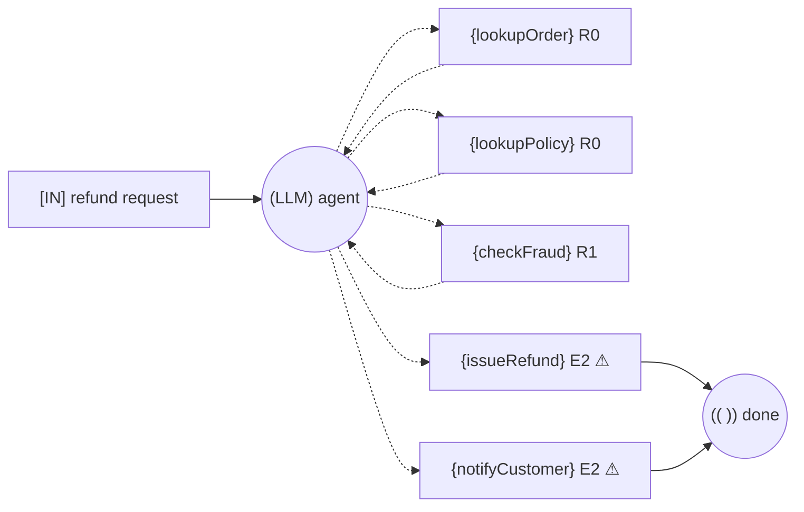
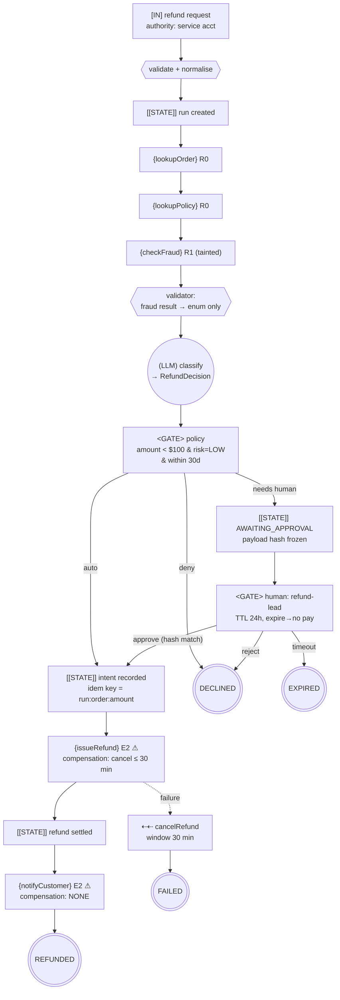

# The Control-Flow Graph Method

> Draw the graph before you write the `ChatClient`.

A control-flow graph (CFG) for an agentic system is a small, deliberately boring diagram whose only
job is to make three things impossible to overlook:

1. where the system stops being deterministic,
2. where it touches the world in a way it cannot take back,
3. where a human has to say yes.

It takes ten minutes. It is the cheapest review artefact you will ever produce, and it is the one
that catches duplicate payments before they exist.

---

## 1. Notation

### Nodes

| Node | Symbol | Meaning | Must record |
|------|--------|---------|-------------|
| Ingress | `[IN]` | untrusted input enters | source, authority (whose permissions) |
| Model | `(LLM)` | a model decision — a nondeterministic branch | model, purpose, output type |
| Tool | `{TOOL}` | an effect on the world | boundary class (`R0…P1`) |
| Gate | `<GATE>` | a deterministic policy or human approval | rule or approver role |
| Checkpoint | `[[STATE]]` | durable state you could resume from | what is persisted |
| Egress | `[OUT]` | data leaves your boundary | recipient, data class |
| Terminal | `((TERM))` | end of run | which outcome |

### Edges

| Edge | Drawn as | Meaning |
|------|----------|---------|
| Deterministic | `──▶` | code decides |
| **Model-chosen** | `╌╌▶` | **the model decides** — count these |
| Retry / loop | `↺` | must carry a numeric bound |
| Compensation | `⇠⇠` | undo path, must carry its window |
| Escalation | `──▶ human` | leaves the automated system |

### Annotations

Write these *on the diagram*, not in a separate doc:

* on every `{TOOL}`: its class, e.g. `{issueRefund} E2`
* on every cycle: its bound, e.g. `↺ max 6 steps / 60s / $0.40`
* on every `<GATE>`: its rule, e.g. `<amount < $100 → auto>` or `<approver: refund-lead>`
* on every irreversible tool: `⚠` and its compensation window, or `⚠ NONE`

### The agency budget

Count the `╌╌▶` edges. That number is the amount of nondeterminism you have chosen to accept.
Write it on the diagram: **`agency = 3`**.

Every one of those edges needs a one-line justification. If a branch can be decided by code — a
threshold, a lookup, a regex, a state check — it must be. Model-chosen edges are simultaneously your
flexibility and your entire attack surface.

---

## 2. Drawing rules

Work in this order. Do not skip to step 4.

1. **Terminals first.** List every way the run can end: `APPROVED`, `DECLINED`, `ESCALATED`,
   `EXPIRED`, `FAILED`. If you cannot name them, you do not know the job yet.
2. **Ingress and authority.** One `[IN]` per trigger. Write whose credentials the run uses.
3. **Effects.** Place every `{TOOL}`. Classify each one. Mark the irreversible ones with `⚠`.
4. **Gates before ⚠.** Put a `<GATE>` on *every inbound path* to every `⚠`. Not one gate at the
   top — every path.
5. **Checkpoints before ⚠.** Put a `[[STATE]]` before each `⚠` so intent is recorded before effect.
6. **Then, and only then, the model nodes.** Ask for each: does the model *decide* here, or does it
   *classify* and code decides? Prefer the latter.
7. **Bound every cycle.** Numbers, not adjectives.
8. **Taint.** Shade the region reachable from `R1` (external reads) and MCP tool output. Follow the
   shading forward: if it reaches an `⚠` argument, you need a validator on that edge.
9. **Compensation.** Draw `⇠⇠` for every effect you can undo, with its window. Absence of a `⇠⇠`
   next to a `⚠` is the point of the exercise.

---

## 3. Worked example — the Refund Desk

This is the domain used by every project in this repo.

> A customer asks for a refund. Read the order, apply policy, check fraud signals, then decline,
> refund, or escalate. **Issuing a refund moves money. Emailing the customer cannot be unsent.**

### 3.1 First draft — what people usually build



Review verdict: **fails three of the four graph invariants.**

| Invariant | Violation |
|-----------|-----------|
| No unbounded cycles | the `LLM ↔ TOOL` loop has no bound |
| No ungated one-way doors | `{issueRefund}` and `{notifyCustomer}` have no `<GATE>` |
| No unvalidated taint flow | `{checkFraud}` is `R1`; its text flows back into the model, which then chooses the refund amount |
| No effect before checkpoint | no `[[STATE]]` anywhere |

`agency = 5` — the model chooses whether to pay. Note that the prompt saying *"ask the user before
refunding"* changes nothing in this graph. A prompt is not an access control.

### 3.2 Second draft — the same job, invariants satisfied



`agency = 0`. The model still does the hard part — reading an unstructured complaint and producing a
typed `RefundDecision` — but **code**, not the model, decides whether money moves. The gate reads
the model's classification and applies a threshold.

That is the single highest-value transformation this method produces: *demote the model from driver
to classifier wherever a rule exists.*

### 3.3 Irreversible-action catalogue (Phase 3 output)

| Field | `issueRefund` | `notifyCustomer` |
|-------|---------------|------------------|
| Class | `E2` | `E2` |
| Blast radius | one customer, up to order total | one customer, reputational |
| Detection latency | minutes (ledger reconciliation) | immediate |
| Compensation | `cancelRefund` before settlement | **NONE** |
| Window | ~30 min | — |
| Approval | auto < $100 & risk LOW & ≤30 d; else `refund-lead`; ≥ $1,000 or risk HIGH → dual control | inherits the refund decision |
| Idempotency key | `sha256(runId + orderId + amountMinor)` | `sha256(runId + "notify" + orderId)` |
| Dry-run | yes | yes |
| Rate limit | 1 per order per run; 3 per customer per day | 1 per run |
| Audit | append-only `decision_log` with payload hash | same |

### 3.4 Trust boundaries (Phase 5 output)

```
┌─ untrusted ──────────────────────────────────────────────┐
│  customer message text                                   │
│  fraud provider response body  (R1)                      │
│  retrieved policy documents    (R1 if externally sourced)│
│  MCP tool descriptions         (per-server)              │
└──────────────────────────────────────────────────────────┘
        │  crosses into the context window here
        ▼
   (LLM classify)  ──▶  typed RefundDecision  ──▶  <GATE>  ──▶  {issueRefund}
                         ▲                                        ▲
                         │                                        │
              schema validation                   arguments come from the ORDER record,
              enum-only fraud signal              never from model free text
```

The taint rule in this design is enforced by one concrete decision: **the refund amount passed to
`issueRefund` is read from the order record, not from the model's output.** The model may propose an
amount; the gate compares it to the order and rejects a mismatch. Untrusted text therefore cannot
choose the number.

---

## 4. From CFG to Spring AI code

The graph maps onto the framework almost one-to-one. This is why drawing it first saves time rather
than costing it.

| CFG element | Spring AI / Spring Boot construct | In this repo |
|-------------|-----------------------------------|--------------|
| `[IN]` | `@RestController` + `@Valid` request record | every project |
| `(LLM)` classify | `ChatClient…call().entity(RefundDecision.class)` | 01, 06–09 |
| `(LLM)` decide + act | `ChatClient…tools(...)` with `ToolCallingAdvisor` | 02, 08 |
| `{TOOL}` | `@Tool` method, or `@McpTool` when exposed remotely | 02, 04 |
| tool class metadata | custom `@ToolBoundary` annotation on the method | 02 |
| `<GATE>` policy | a plain Java `PolicyGate` component — deliberately *not* an advisor | 02, 06–09 |
| `<GATE>` human | `ApprovalStore` + suspended run + resume endpoint | 02, 07, 09 |
| `[[STATE]]` | JDBC-persisted run/step rows (`RunRepository`) | 07, 09 |
| taint validator | `Validator` on tool args + `FraudSignal` enum mapping | 02, 05 |
| cycle bound | `spring.ai.tools.limits.*` + `RunBudget` | 02, 08, 09 |
| `⇠⇠` compensation | `CompensationService` invoked by the saga | 07 |
| `[OUT]` | egress allowlist + redaction in `NotificationTool` | 02 |
| `((TERM))` | `RunStatus` enum, exhaustive `switch` | 06–09 |

Two deliberate choices worth calling out:

* **Gates are not advisors.** Spring AI advisors wrap the *model call*. An approval gate must wrap
  the *effect*. Putting the gate in an advisor makes it bypassable by any code path that calls the
  tool directly. In this repo the gate sits inside the tool boundary
  (`GuardedToolExecutor`), so there is no path around it.
* **Budgets are enforced twice.** Once by the framework (`spring.ai.tools.limits.*`, which protects
  the model loop) and once by your own `RunBudget` (which protects cost and wall clock across the
  whole run, including non-model work).

---

## 5. Anti-patterns to look for in someone else's graph

| Shape | Why it is wrong | Fix |
|-------|-----------------|-----|
| `(LLM) ╌╌▶ {E2}` with no gate between | prompt-level control only | insert `<GATE>` |
| A single `<GATE>` at the top, effects deeper down | any later path bypasses it | gate each inbound path to each `⚠` |
| `<GATE>` implemented as a chat turn | not durable, not frozen, not attributed | persist the suspension |
| Cycle with no number | becomes a timeout, then a 500, then a stuck run | numeric bound + exhaustion edge |
| `[[STATE]]` after the effect | crash leaves no record of intent | move it before |
| `R1 ──▶ {E2}` argument | direct injection into an irreversible action | validator, or read the value from a trusted record |
| Retry arrow around a group that contains an `⚠` | replays money | retry only idempotent segments |
| No `((EXPIRED))` terminal | approvals that are never answered hang forever | add expiry |
| Two agents sharing one credential set | no least authority | split credentials per handoff contract |

---

## 6. Reusable template

Copy [`templates/CFG-TEMPLATE.md`](templates/CFG-TEMPLATE.md) into `docs/CFG.md` of your service.
Every project in this repo has one — start with
[`06-workflow-orchestration/docs/CFG.md`](../06-workflow-orchestration/docs/CFG.md) and
[`07-state-machine-orchestration/docs/CFG.md`](../07-state-machine-orchestration/docs/CFG.md) to see
how the same job looks under two architectures.

---

**Next:** [02 — Architecture Comparison](02-ARCHITECTURE-COMPARISON.md)
