# Architecture and Dataflow

Every project already has a **control-flow graph** in its own `docs/CFG.md` — what happens, in what
order, and where the gates are. This document covers the two views those do not:

* **Architecture** — what the components are, which layer they sit in, and what depends on what.
* **Dataflow** — what data moves where, its classification, and every trust boundary it crosses.

The dataflow diagrams are deliberately drawn in DFD style with explicit trust boundaries, because
that is the form a security review can actually read.

---

## Legend

| Notation | Meaning |
|----------|---------|
| `R0` `R1` `W1` `W2` `E1` `E2` `P1` | tool boundary class — see [03 — Tool Boundaries](03-TOOL-BOUNDARIES.md) |
| ⚠ | irreversible action |
| **C** / **I** / **R** | data classification: Confidential, Internal, Regulated |
| dashed edge | **model-chosen** — the agency budget counts these |
| dashed box | trust boundary; content inside is untrusted |
| 🛡 | a deterministic validator or gate |

---

## 1. System context

Nine services, one domain, and the external systems they touch. Numbers in brackets are ports.

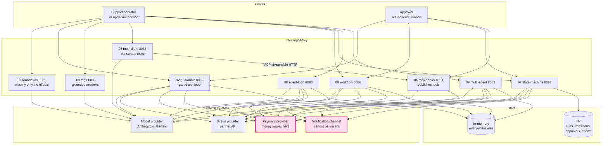

Two things to read off it:

* **Project 04 has no arrow to the model provider.** An MCP server is an ordinary service that
  publishes tools; that is exactly why it must enforce its own policy rather than trust its caller.
* **Only project 07 has a database.** That single difference is what makes its approvals durable,
  and it is the whole argument of [02 — Architecture Comparison](02-ARCHITECTURE-COMPARISON.md).

---

## 2. The layered shape every project shares

Different orchestration, same layering. The load-bearing rule is visible as an absence: **there is
no edge from the model to the effects layer.**

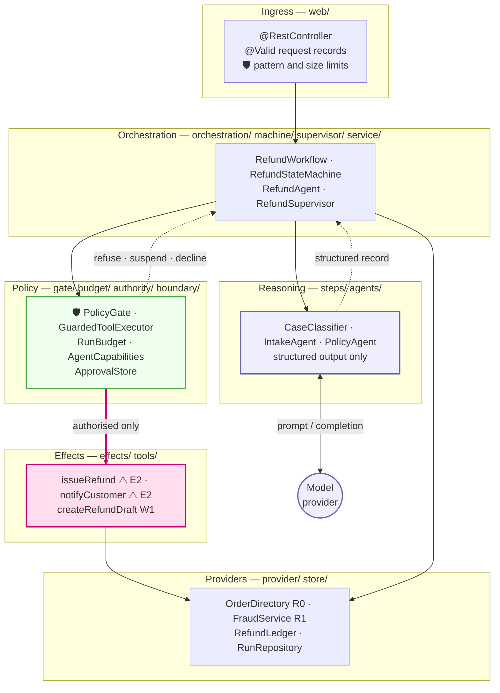

| Rule | How the diagram shows it |
|------|--------------------------|
| The model classifies; code decides | `Reasoning` returns a record to `Orchestration`; it has no edge to `Policy` or `Effects` |
| No ungated one-way door | the only inbound edge to `Effects` comes from `Policy` |
| Gates are not advisors | `Policy` sits between orchestration and effects, not around the model call |
| Providers are reached directly for reads | `Orchestration → Providers` exists for `R0`/`R1` reads |

---

## 3. Component architecture

### 3.1 Project 02 — the guardrail core

Projects 06–09 change the orchestration and reuse this shape.

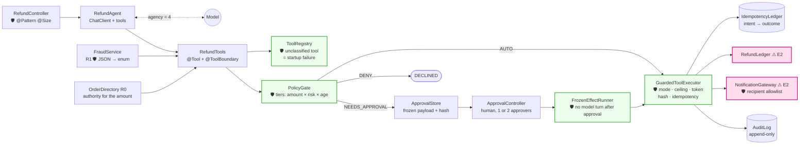

### 3.2 Project 03 — retrieval with a verification gate

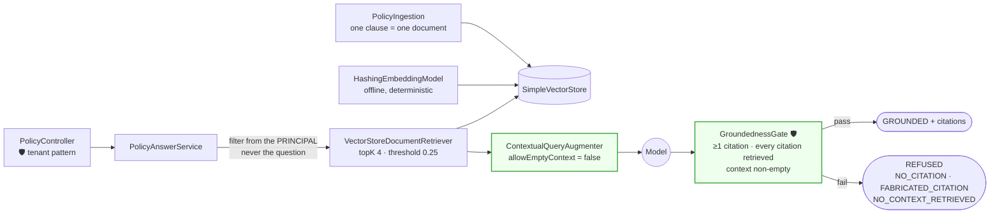

The citation check resolves against **retrieval metadata**, not against the model's claim about what
it read. That is the whole trick.

### 3.3 Projects 04 + 05 — the MCP pair, two processes

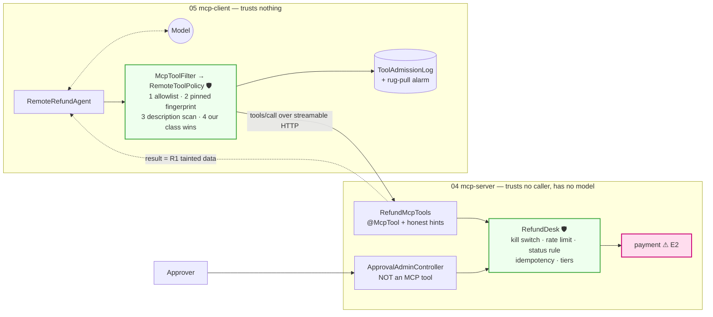

The division of labour: **the client controls exposure, the server controls execution.** Neither can
do the other's job, and approval is reachable from neither the model nor the MCP surface.

### 3.4 The four orchestrations, same job

**06 workflow** — a fixed DAG; `agency = 0`; the call sequence is assertable.

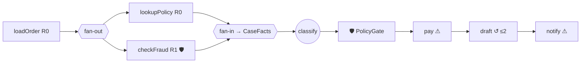

**07 state machine** — states are rows; approvals durable; crash recovery designed.

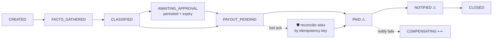

**08 agent loop** — the model picks the next tool; seven budgets bound it.

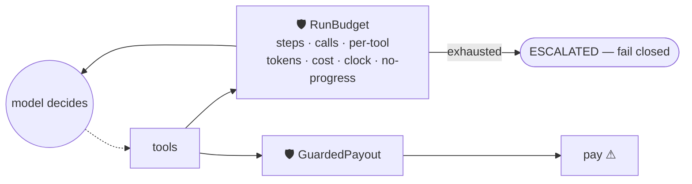

**09 multi-agent** — separation of authority; supervisor is code.

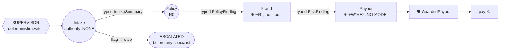

---

## 4. Dataflow

### 4.1 Level 0 — context, with classification and trust boundaries

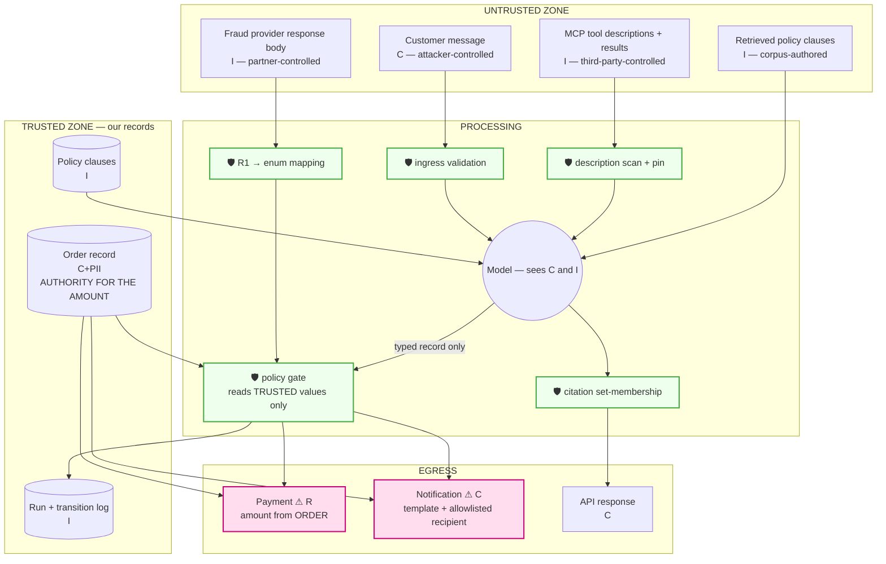

**The single most important edge in this repository is the one that does not exist:** there is no
path from the untrusted zone into `PAYO`'s amount. The amount is read from `ORDER`.

### 4.2 Level 1 — the refund decision, boundary by boundary

Boundaries **B1–B5**: turning a request into a decision. Every green box is a deterministic
validator, and untrusted data is transformed at each one rather than carried forward as-is.

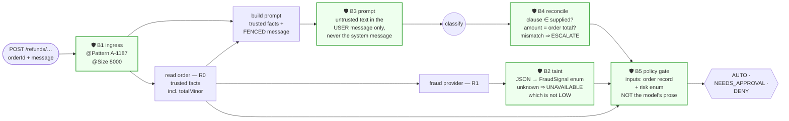

Boundaries **B6–B9**: turning a decision into an effect. Note that the approved path does **not**
re-enter the model, and that the intent is recorded before the money moves.

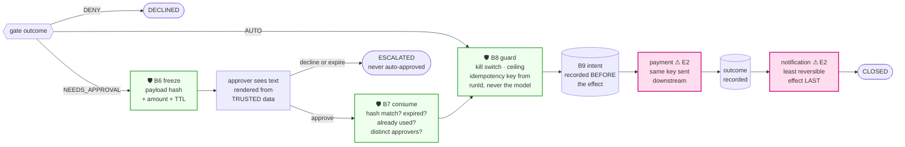

| # | Boundary | Untrusted input | Validator | Test |
|---|----------|-----------------|-----------|------|
| B1 | ingress | HTTP body | Bean Validation, order-id pattern | `rejectsBadOrderId` |
| B2 | `R1` result | partner JSON | map to `FraudSignal`, unknown ⇒ `UNAVAILABLE` | `fraudProviderInjectionIsDroppedAtTheBoundary` |
| B3 | prompt | customer text | fenced user message, size-clipped | `untrustedTextNeverEntersTheSystemMessage` |
| B4 | model output | clause id, amount | must be supplied / must equal order total | `fabricatedClauseEscalates`, `amountMismatchEscalates` |
| B5 | decision | — | gate reads trusted values only | `PolicyGateTest` |
| B6 | approval | — | payload hash frozen | `refusesPayloadMismatch` |
| B7 | resume | approver identity | hash, expiry, single use, distinct approvers | `expiryNeverPays`, `dualControl` |
| B8 | effect | — | kill switch, ceiling, system-derived key | `killSwitchRefuses`, `idempotencyStopsASecondPayment` |
| B9 | checkpoint | — | intent recorded before the effect | `twoPhaseExecution` |

### 4.3 Where untrusted text can and cannot reach

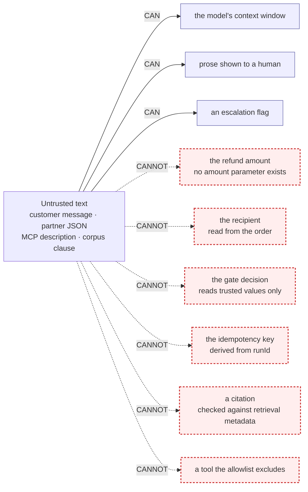

Each "CANNOT" is structural rather than a prompt instruction — usually because the parameter simply
does not exist.

---

## 5. Key sequences

### 5.1 Automatic tier — nothing interrupts a human

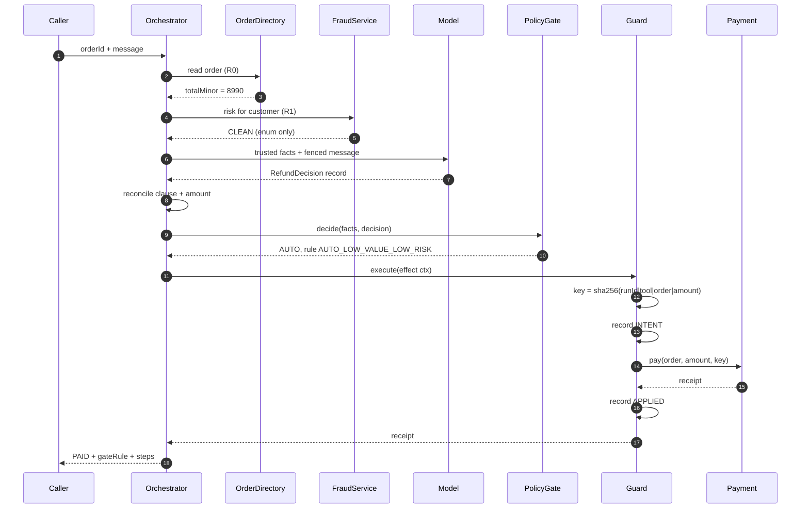

### 5.2 Human approval — and the attack the frozen hash defeats

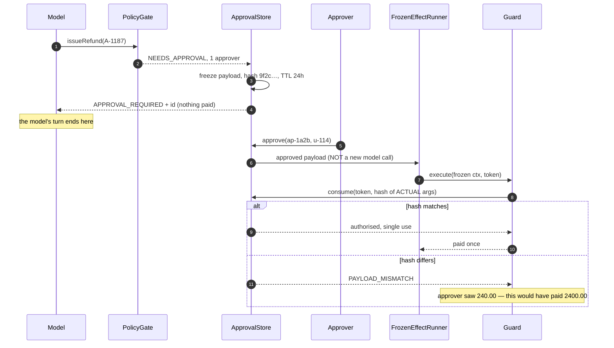

### 5.3 MCP tool admission — before the model sees anything

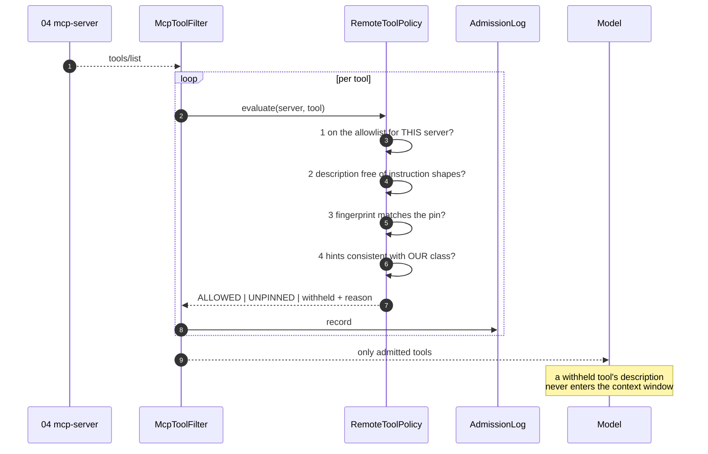

### 5.4 Budget exhaustion — fail closed

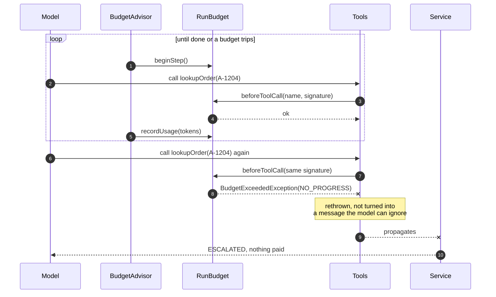

---

## 6. Deployment

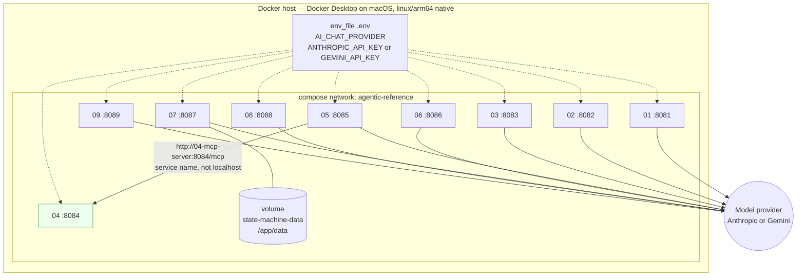

Each image is multi-stage with layered-jar extraction, runs as non-root, and carries a
`HEALTHCHECK` on `/actuator/health`. Project 04 needs no API key of any kind. Full walkthrough:
[RUNNING-WITH-DOCKER.md](RUNNING-WITH-DOCKER.md).

---

## 7. Keeping these current

These diagrams describe structure. When a change alters it:

| Change | Update |
|--------|--------|
| a new component or layer | §2 / §3 |
| a new tool, or a tool's boundary class | §3, §4.1, and the project's `docs/CFG.md` |
| a new trust boundary or validator | §4.1, §4.2 **and its table row** |
| a new external system | §1 |
| a new gate or budget | §3, §5 |
| anything about ports or containers | §6 and `docker-compose.yml` |

The per-project `docs/CFG.md` remains the authority on **control flow and the four graph
invariants**; this document is the structural companion to it.
