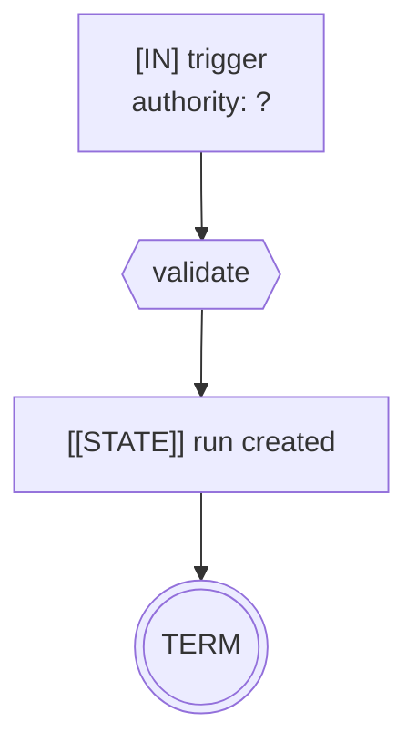

# Control-Flow Graph — `<service name>`

> Copy this file to `docs/CFG.md` in your service and fill it in **before** writing agent code.
> Notation reference: [01 — Control-Flow Graph Method](../01-CONTROL-FLOW-GRAPH.md).

| Field | Value |
|-------|-------|
| Service | |
| Job statement | *Given X, the system decides Y and may do Z.* |
| Trigger(s) | |
| Authority (whose credentials) | |
| Architecture | workflow \| state machine \| agent \| multi-agent \| hybrid |
| Architecture justification | *the specific runtime decision code cannot make* |
| Agency budget (count of model-chosen edges) | |
| Per-run cost ceiling | |
| Wall-clock deadline | |
| Data classes touched | |
| Terminal states | |

---

## 1. Graph



Legend: `[IN]` ingress · `(LLM)` model decision · `{TOOL}` effect · `<GATE>` policy/approval ·
`[[STATE]]` durable checkpoint · `[OUT]` egress · `((TERM))` terminal · `⚠` irreversible.

---

## 2. Tool boundary table

| Tool | Class | Reversible | Idempotency key | Dry-run | Rate limit | Notes |
|------|-------|-----------|-----------------|---------|------------|-------|
| | `R0`/`R1`/`W1`/`W2`/`E1`/`E2`/`P1` | | | | | |

---

## 3. Irreversible-action catalogue

| Field | `<action 1>` | `<action 2>` |
|-------|--------------|--------------|
| Class | | |
| Blast radius | | |
| Detection latency | | |
| Compensation | | |
| Compensation window | | |
| Approval authority | | |
| Dual control? | | |
| Idempotency key | | |
| Dry-run | | |
| Rate limit | | |
| Audit record | | |

If this table is empty, state why: ________________________________________

---

## 4. Approval points

| # | Gate | Type (policy / human / dual) | Rule or approver role | TTL | On timeout | On reject |
|---|------|------------------------------|-----------------------|-----|------------|-----------|
| 1 | | | | | | |

Seven-property check for each human gate:

| Property | 1 | 2 |
|----------|---|---|
| Durable | ☐ | ☐ |
| Frozen (payload hash) | ☐ | ☐ |
| Attributed | ☐ | ☐ |
| Bounded (expiry) | ☐ | ☐ |
| Replay-safe | ☐ | ☐ |
| Legible | ☐ | ☐ |
| Refusable | ☐ | ☐ |

---

## 5. Trust boundaries

```
┌─ untrusted ─────────────────────────────┐
│  (list every source of tainted content) │
└─────────────────────────────────────────┘
```

| Boundary | Untrusted source | Validator (function name) | Test |
|----------|------------------|---------------------------|------|
| prompt | | | |
| tool args | | | |
| MCP server `<name>` | | | |
| egress | | | |

**Taint rule:** no path from an untrusted source to an irreversible argument without a deterministic
validator. Paths checked: ______________________________________________

---

## 6. Budgets

| Budget | Limit | Enforced by | On exhaustion (must fail closed) |
|--------|-------|-------------|----------------------------------|
| Steps / iterations | | | |
| Tool calls (total) | | | |
| Tool calls (per tool) | | | |
| Tokens per run | | | |
| Cost per run | | | |
| Wall clock | | | |
| Retries per tool | | | |
| No-progress steps | | | |

---

## 7. Failure paths

| Failure | Detection | Response | Terminal state |
|---------|-----------|----------|----------------|
| Model timeout | | | |
| Model refusal / safety stop | | | |
| Unparseable output | | | |
| Tool timeout | | | |
| Tool 5xx | | | |
| Store unavailable | | | |
| Crash between intent and effect | | | |
| Compensation failed | | | |

---

## 8. Graph invariants

| Invariant | Holds? | Evidence |
|-----------|--------|----------|
| 1. No unbounded cycles | ☐ | |
| 2. No ungated one-way doors | ☐ | |
| 3. No unvalidated taint flow | ☐ | |
| 4. No effect before checkpoint | ☐ | |

---

## 9. Observability

| Signal | Where |
|--------|-------|
| Run record | |
| Step records | |
| Decision log (model + gate) | |
| Metrics | |
| Replay supported? | |

---

## 10. Review

| Gate (checklist Phase 10) | Owner | Status |
|---------------------------|-------|--------|
| 0 Frame | | ☐ |
| 1 CFG + invariants | | ☐ |
| 2 Tool classes | | ☐ |
| 3 Irreversible catalogue | | ☐ |
| 4 Approvals | | ☐ |
| 5 Trust boundaries | | ☐ |
| 6 Architecture choice | | ☐ |
| 7 Budgets | | ☐ |
| 8 Failure paths | | ☐ |
| 9 Observability | | ☐ |
| 10 Runbook + kill switch | | ☐ |
